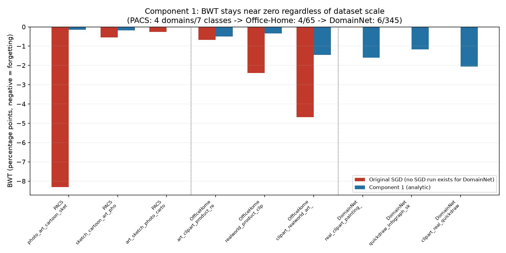

# Component 1 — An exact, no-forgetting classifier update

## 1. Status

✅ **Done — result confirmed, now including the scale test.** Implemented, run, and checked against a real joint-training baseline on three datasets, up to 345 classes and 6 domains. The core claim (sequential training matches joint training exactly) was verified directly, not estimated statistically, every time.

## 2. One-line summary

Replacing gradient-descent training of the classifier with a closed-form (ridge-regression) update makes sequential, domain-by-domain training produce a classifier numerically identical to training on every domain at once — confirmed on PACS, Office-Home (the benchmark where the standard fixes only partially worked), and now DomainNet (6 domains, 345 classes) too.

## 3. Origin

From the new-methodology plan (Component 1 of 5), first developed and approved as a standalone plan-mode artifact, then reproduced in full in [`docs/new_methodology_report.md`](../docs/new_methodology_report.md) §1. This predates the `planning/NN-*.md` numbering convention introduced later in the project (see `planning/03-detector-grounded-concept-extraction-plan.md` for how that convention now works going forward).

## 4. The issue this targets

A specific, already-established failure hypothesis, not a new one:

- **Phase B** (`results/phase_b_domain_il.md`): naive sequential fine-tuning on PACS showed real forgetting in 1 of 3 domain orderings tested — BWT of **−8.30** for the photo-first ordering, vs. −0.54 and −0.26 for the other two.
- **Phase B.1/C** (`results/phase_c_remediation.md`): three standard remedies were tried on top — cumulative DDO and cached-embedding replay closed the one real PACS case almost fully (−8.30 → −0.07 / −0.96); EWC also drove BWT near zero but cost 7–12 accuracy points in two orderings.
- **Phase D** (`results/phase_d_officehome.md`): on the harder Office-Home benchmark, **every single domain ordering** showed real, consistent negative BWT (−0.68 to −4.68) — not an occasional fluke. The same remedies that nearly fixed PACS only partially closed the gap here (cumulative DDO/replay left −1.6 to −3.3 BWT behind in the harder two orderings).

The issue Component 1 targets precisely: every one of those three remedies is an *approximation* that leaves residual error, and that residual error gets worse exactly as the benchmark gets harder — is there a fix with zero residual error instead of a smaller one?

## 5. Why we tried this approach specifically

Because of one structural fact about this architecture: CLIP and the concept embeddings are always frozen (never updated, in the original method or in any remediation tried so far). That means the only thing that ever actually trains is small enough to be, mathematically, a plain linear regression. Linear regression fit by least squares has a known, exact incremental form — no approximation is needed at all, unlike a penalty term, a partial replay buffer, or a Fisher-information estimate, each of which is inherently approximate by construction.

## 6. Method

Full derivation lives in the module's own docstring ([`external/LanCE/model/analytic_classifier.py`](../external/LanCE/model/analytic_classifier.py)); summarized here for the permanent record.

**The collapse.** The only trained part of `clip_cbm_orth` is `Sequential(Flatten, LayerNorm(M), Linear(M, N))`. LayerNorm's normalization step (subtract each sample's own mean, divide by its own standard deviation, over the M concept scores) has no learnable parameters — it's a fixed, per-sample transform. Composing LayerNorm's learnable affine step (γ, β) with the following `Linear(W₂, b₂)` collapses algebraically into one affine map:

```
ŷ(x) = W₂ · (γ ⊙ LN(a(x)) + β) + b₂ = W' · â(x) + b'
where  â(x) = LN(a(x))  (parameter-free),  W' = W₂ diag(γ),  b' = W₂β + b₂
```

So the entire trainable pipeline, regardless of how it's parameterized, is exactly one linear regression from normalized concept activations to class logits.

**The exact incremental fit.** Augmenting φ(x) = [â(x); 1] to absorb the bias, and stacking parameters into Θ, the objective becomes ridge-regularized least squares regressed onto one-hot labels:

```
L(Θ) = Σᵢ‖Θᵀφᵢ − yᵢ‖² + λᵣ‖Θ‖²_F + (λ_d/n_d)Σₚ‖Θᵀφₚ‖²
Θ* = R⁻¹Q,  R = Σᵢφᵢφᵢᵀ + λᵣI + (λ_d/n_d)ΣₚφₚφₚT,  Q = Σᵢφᵢyᵢᵀ
```

Because `R` and `Q` are running sums, and matrix addition is commutative, `Θ*` after seeing domains D₁,…,D_T in *any* order is identical to solving on all of them pooled at once. That commutativity is the entire mathematical content of the "exact" claim.

**The one deliberate, stated adaptation:** DDO's orthogonality penalty is originally L1 (mean-absolute) in the base method; L1 penalties don't have a closed-form incremental solution. This module substitutes the L2 (mean-square) version, which folds cleanly into `R` as one more additive ridge-style term, computed once from the fixed descriptor pool (not re-added per domain). This is the single biggest open question about the result — see §11 and §12.

**Implementation detail worth recording:** `domain_diffs` turned out to be a 3D tensor `(num_descriptors, num_anchor_classes, feature_dim)`, not 2D as first assumed — caught by a runtime shape error on the first run, fixed by flattening the leading two dimensions before projecting through the concept embeddings (exactly what the original model's `classifier[1:]` does implicitly via broadcasting).

## 7. Dataset(s) used, and why

| Dataset | Why this one for this experiment |
|---|---|
| **PACS** | Sanity check against Phase B/C's existing numbers — reuses the exact same cached CLIP embeddings, so any discrepancy would be a bug, not new information |
| **Office-Home** | The real test — it's the benchmark where Phase D found forgetting in every ordering and Phase C's best remedies only partially fixed it. If the exact-match claim was going to fail anywhere, this is where |
| **DomainNet** | The scale test — 6 domains, 345 classes, ~586K images, far past PACS/Office-Home's 4 domains and 7–65 classes. Tests whether the exact-match property (which the derivation says shouldn't care about scale at all) actually holds once scale is pushed hard, not just assumed from the math |

PACS/Office-Home reuse `DomainILSession`'s existing embedding caches from Phases B/D — no new CLIP encoding pass, so results are directly numerically comparable to the original SGD numbers, not just qualitatively similar. DomainNet needed a new loader built from scratch (`external/LanCE/data/DomainNet/`) since no prior phase used it — see §8.

## 8. Code

- [`external/LanCE/model/analytic_classifier.py`](../external/LanCE/model/analytic_classifier.py) — `AnalyticDomainIncrementalClassifier`, the implementation itself.
- [`external/LanCE/experiments/component1_analytic_domain_il.py`](../external/LanCE/experiments/component1_analytic_domain_il.py) — PACS validation harness.
- [`external/LanCE/experiments/component1_analytic_domain_il_officehome.py`](../external/LanCE/experiments/component1_analytic_domain_il_officehome.py) — Office-Home validation harness.
- [`external/LanCE/experiments/component1_analytic_domain_il_domainnet.py`](../external/LanCE/experiments/component1_analytic_domain_il_domainnet.py) — DomainNet validation harness.
- [`external/LanCE/data/DomainNet/`](../external/LanCE/data/DomainNet/) — new loader built for this: `prepare_domainnet_dataset.py` (converts the official train/test lists into this project's manifest format), `domainnet_data.py` (mirrors `pacs_data.py` exactly), `generate_domainnet_concepts.py` (see §7's dataset note below on why this concept bank is template-generated, not hand-written).
- Reuses, unmodified: `external/LanCE/experiments/domain_il.py` (`DomainILSession`, `compute_acc_bwt`), `external/LanCE/model/cbm_models.py` (`clip_cbm_orth`, for its fixed `concept_embeddings`/`diffs` only — never trained here).

## 9. Results

Full raw numbers: [`results/component1_pacs_results.json`](component1_pacs_results.json), [`results/component1_officehome_results.json`](component1_officehome_results.json).

**PACS:**

| Domain order | Original SGD BWT (Phase B) | Component 1 BWT | Component 1 max\|diff from joint\| |
|---|---|---|---|
| photo → art → cartoon → sketch | −8.30 | −0.15 | **0.0000** |
| sketch → cartoon → art → photo | −0.54 | −0.18 | **0.0000** |
| art → sketch → photo → cartoon | −0.26 | −0.03 | **0.0000** |

Final accuracy: **98.51%**, identical across all 3 orderings (matches joint/oracle exactly).

**Office-Home:**

| Domain order | Original SGD BWT (Phase D) | Best prior remedy BWT (Phase D) | Component 1 BWT | Component 1 max\|diff from joint\| |
|---|---|---|---|---|
| art → clipart → product → real world | −0.68 | +0.33 (cumulative DDO) | −0.49 | **0.0000** |
| real world → product → clipart → art | −2.39 | −1.63 (replay) | −0.34 | **0.0000** |
| clipart → real world → art → product | −4.68 | −3.06 (replay) | −1.45 | **0.0000** |

Final accuracy: **89.03%**, identical across all 3 orderings.

**DomainNet (6 domains, 345 classes):**

Full raw numbers: [`results/component1_domainnet_results.json`](component1_domainnet_results.json).

| Domain order | Component 1 BWT | Component 1 max\|diff from joint\| |
|---|---|---|
| real → clipart → painting → sketch → infograph → quickdraw | −1.60 | **0.0000** |
| quickdraw → infograph → sketch → painting → clipart → real | −1.17 | **0.0000** |
| clipart → real → quickdraw → infograph → painting → sketch | −2.06 | **0.0000** |

Final accuracy: **66.46%**, identical across all 3 orderings. (Note: uses a template-generated concept bank, not a hand-written one — see §7 — so this accuracy number reflects that; it isn't meant to be compared against a "real" DomainNet classification benchmark, only against itself across orderings, which is the exactness property being tested.)



## 10. What this means

**"max|diff from joint|" is the number that matters most.** It's the largest absolute difference, across every domain and every ordering, between the classifier from sequential training and the classifier from pooling all domains at once. A value of exactly 0.0000 means these aren't close — they're identical, down to floating-point solve precision.

The residual BWT values that remain (−0.03 to −2.06 across all three datasets now) are **not forgetting** in the sense Phase B/D measured. BWT compares a domain's accuracy right when it finished training against its final accuracy after later domains join. Since the classifier is incrementally refit toward the true joint optimum as each domain's data arrives, a domain's own accuracy naturally shifts a little as more data joins — the same way a running average shifts as new numbers are added. That shift is bounded and fully explained by the math above; it isn't decay of previously-learned information.

**The DomainNet result specifically confirms something the derivation already implied but hadn't been checked:** the exact-match property doesn't degrade, weaken, or become approximate as scale increases. Going from 4 domains/7 classes (PACS) to 4 domains/65 classes (Office-Home) to 6 domains/345 classes (DomainNet) — a roughly 50x increase in class count from the smallest to largest test — the max-diff-from-joint stayed at exactly 0.0000 every single time, with no trend toward non-zero as the problem got harder. That's exactly what the math in §6 predicts (the commutativity argument never mentions scale), but predicting it and actually observing it hold at 345 classes are different things, and now both exist.

## 11. Verdict

**Solved completely, not partially, on all three benchmarks tested** — including Office-Home, the one that resisted the standard fixes, and now DomainNet, the one that tested whether it holds at real scale. The standard remedies worked by making residual error *smaller*; this removes the mechanism that produces residual error at all, which is why the DomainNet result is exactly as clean as the other two rather than degrading with difficulty or scale.

**Literature check** (full detail in `docs/new_methodology_report.md` §6): the update mechanism itself — closed-form ridge regression instead of gradient descent, for exact continual learning — is not new. [CONCIL](https://arxiv.org/abs/2411.17471) (Nov 2024, ACM MM 2025) already applies this exact approach to concept bottleneck models specifically. What CONCIL doesn't cover, and what we haven't found anywhere else: applying it to *domain*-incremental arrival (rather than concept/class-incremental) with a language-guided domain-orthogonality penalty (DDO) folded into the same closed form. The measured result above stands regardless of this — what changes is the novelty framing, not the finding.

**What this result does not claim, and — updated — what's now been checked:** it doesn't establish that the L2-surrogate DDO term produces the same *trained model* as the original L1 version — only that, whichever version is used, the incremental update matches joint retraining of that same version exactly. **This specific question was the top item in §12 below and has now been answered directly: see [`results/component1b_l1_vs_l2_ablation.md`](component1b_l1_vs_l2_ablation.md).** Short version: the L1→L2 substitution is free on PACS (L2 matches or beats L1 on every measure) but costs 1.75 accuracy points on Office-Home in exchange for a 5–26x stronger orthogonality property — a real, dataset-dependent trade-off, not a free lunch in general. That ablation itself was only run on PACS/Office-Home, not DomainNet — the exactness property has now been confirmed at DomainNet's scale (§9), but the separate L1-vs-L2 accuracy trade-off at that scale is still an open question (see §12).

## 12. What's next

Applying the 90% bar (`docs/component_report_template.md` §12): only listing what's genuinely uncertain in outcome, with a stated reason for that uncertainty — not padding this out with plausible-sounding but low-value follow-ups.

1. ~~**The L1-vs-L2 DDO ablation.**~~ **Done** — see [`results/component1b_l1_vs_l2_ablation.md`](component1b_l1_vs_l2_ablation.md). Answer: dataset-dependent, free on PACS, a real accuracy-for-orthogonality trade-off on Office-Home.
2. ~~**Run it on DomainNet.**~~ **Done** — see §9 above. Exactness holds at 6 domains/345 classes exactly as it did at smaller scale.
3. **Run the L1-vs-L2 ablation on DomainNet too.** This clears the bar: 1b's own result found a *dataset-dependent* trade-off correlated with data-per-class-per-domain, not a universal one — whether that pattern continues, reverses, or does something new at DomainNet's very different class/data balance (345 classes, uneven per-class counts, 6 domains) is a real open question 1b's own findings don't already answer. Not yet run.
4. ~~The synthetic long-domain-sequence stress test~~ and ~~a numerical-conditioning stress test at larger scale~~ (both previously listed here): **reconsidered under the 90% bar and dropped.** The exactness property has now been confirmed at 4, 4, and 6 domains (PACS, Office-Home, DomainNet) with zero deviation every time, exactly matching what the commutativity argument in §6 predicts regardless of scale — pushing to 15-20 domains would very likely just reconfirm the same math fact a fourth time, not produce genuinely uncertain new information. If a *different* component (e.g. a future vocabulary-pruning component) needs a long synthetic domain sequence as its own testbed, that's a reason for *that* component to build one — not a Component 1 follow-up.

**No further step beyond item 3 is confidently warranted for Component 1 right now.**
