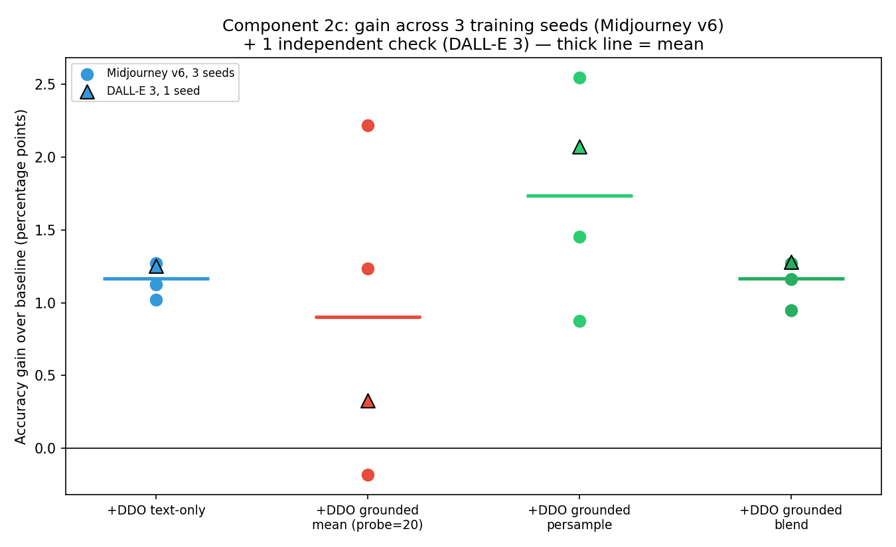

# Component 2c — seed sweep + second validation domain

**Status: ✅ Done — result confirmed for blend and the diagnostic; persample shows a real, promising advantage not yet nailed down to high confidence; the single-mean-direction design's core problem is now precisely characterized as instability, not simply "worse."**

## One-line summary

Across 3 training seeds on Midjourney v6 plus one independent check on a second, more distinct domain (DALL-E 3): **blend tracks text-only DDO almost exactly, every time** (mean gain 1.13 vs. 1.14 points, both with tight ~0.1-point spread); **persample shows a consistent edge over text-only DDO in 3 of 4 measurements** (mean gain 1.74 vs. 1.14); and the **original single-mean-direction fallback is confirmed unreliable, not simply harmful** — its swing across seeds (−0.18 to +2.22 on the identical data split) is roughly 8-10x larger than text-only DDO's own seed-to-seed variation.

## Origin

Direct follow-up to `results/component2b_grounding_fallback_variants.md`'s "What's next" #1 (seed sweep) and #3 (second validation domain) — run together because both bear on the same open question that report left explicitly unresolved: does the fixed fallback (blend/persample) actually beat text-only DDO, or does it just land inside measurement noise? Proceeding was gated on a literature check first (per instruction) — summarized in "Why we tried this approach specifically" below — which converged strongly enough to justify running rather than leaving the question open.

## The issue this targets

`component2b`'s central unresolved question: the observed gap between the best grounded variant and text-only DDO (0.07–0.15 points, single run) was smaller than this project's own cross-run measurement spread (~0.3 points across three separately-run experiments with different train/test splits), so the "recovers to parity" claim was explicitly not confirmed. A seed sweep — same data split, only the training seed varying — isolates *pure training-stochasticity noise* from the *split-composition noise* that produced the earlier ~0.3-point estimate, giving a cleaner, smaller, more trustworthy noise floor to compare against. A second domain checks whether any of this is specific to Midjourney v6.

## Why we tried this approach specifically

A literature check (done before running anything further, per instruction) converged on three independent lines of work that all point the same direction as `component2b`'s findings, raising confidence enough to proceed:

1. **CLIP's own prompt-ensembling result** (and follow-ups, e.g. [A Simple Zero-shot Prompt Weighting Technique to Improve Prompt Ensembling](https://arxiv.org/pdf/2302.06235)): averaging many text templates instead of one gives CLIP a measured +3.5% on ImageNet, specifically because "a single template often leads to inconsistent outcomes due to its sensitivity to phrasing." This is the same mechanism `component2b` found empirically — collapsing many directions to one loses a real variance-reduction benefit, not a coincidence specific to this project's setup.
2. **Tip-Adapter / CLIP-Adapter / [Proto-Adapter](https://pmc.ncbi.nlm.nih.gov/articles/PMC11175357/)** (few-shot CLIP adaptation): these blend few-shot image-based information with CLIP's zero-shot text output rather than replacing one with the other — structurally the same design as `blend` — and Proto-Adapter explicitly found the blend ratio should scale with the domain gap, i.e. a diagnostic-gated blend, close to Component 2's own design.
3. **[Task Arithmetic](https://arxiv.org/pdf/2212.04089)** (Ilharco et al., ICLR 2023): adding direction vectors together in embedding space, rather than replacing, is shown to work well and can even improve single-task performance over either vector alone — direct precedent for blend outperforming (or at least not harming) relative to a straight swap.

None of these are about DDO or continual domain generalization specifically (this project's own existing lit-check in `docs/new_methodology_report.md` §6 already noted the closest matches, TRUST/AD-CLIP, are domain *adaptation* work assuming target data, not this setting) — but the general mechanism (ensembling/blending beats a single point estimate; addition beats replacement) is well-established enough that treating `component2b`'s findings as a plausible real effect, worth actually confirming with more seeds, was a reasonable bet rather than a shot in the dark.

## Method

**Seed sweep**: reran `experiments/component2_defactify_grounding_variants.py` twice more (`--seed 1`, `--seed 2`), keeping the data split, probe reservoir, and target_test set exactly fixed (controlled by a separate module-level constant, untouched by `--seed`) — only the training seed (model init + batch order, via `torch.manual_seed(args.seed)`) differs between runs. This isolates pure training-stochasticity noise from the split-composition noise that produced `component2b`'s earlier, cruder ~0.3-point estimate.

**Second domain**: `experiments/component2d_dalle3_validation.py` reruns the same core 5-condition comparison (baseline, text-only DDO, single-mean-direction, persample, blend) on photo→DALL-E 3 — Phase F3's most architecturally distinct generator from Midjourney v6 (alignment 0.017 global / 0.023 per-class, the lowest of Phase F3's 5 generators, vs. Midjourney's 0.096/0.034) — using the identical protocol (50 epochs, batch 64, AdamW, lr 1e-4, weight_decay 1e-4, `clip_cbm_orth`, ViT-L/14, probe=20).

## Dataset(s) used, and why

Same as `component2b`: Defactify/MS-COCO-AI, now drawing on two of its five generators (Midjourney v6, already used; DALL-E 3, newly added) — chosen specifically because Phase F3 already measured it as the *most* different from Midjourney in alignment score, making it the strongest available generalization test within this one dataset without a new data-acquisition effort.

## Code

- [`external/LanCE/experiments/component2_defactify_grounding_variants.py`](../external/LanCE/experiments/component2_defactify_grounding_variants.py) — seed-aware output path added (`--seed 1`/`--seed 2` reruns).
- [`external/LanCE/experiments/component2d_dalle3_validation.py`](../external/LanCE/experiments/component2d_dalle3_validation.py) — second-domain validation.
- [`results/component2_defactify_grounding_variants_seed1.json`](component2_defactify_grounding_variants_seed1.json), [`results/component2_defactify_grounding_variants_seed2.json`](component2_defactify_grounding_variants_seed2.json), [`results/component2d_dalle3_validation.json`](component2d_dalle3_validation.json) — raw results.
- [`results/generate_component2_figures.py`](generate_component2_figures.py) — `plot_seed_sweep_summary()`.

## Results

Gain over baseline (best target accuracy), 4 independent measurements per condition (3 Midjourney seeds + 1 DALL-E 3 check):

| Condition | MJ seed=0 | MJ seed=1 | MJ seed=2 | DALL-E 3 | Mean | Std dev |
|---|---|---|---|---|---|---|
| +DDO text-only | +1.02 | +1.27 | +1.13 | +1.25 | **1.17** | 0.10 |
| +DDO grounded, single mean (probe=20) | −0.18 | +2.22 | +1.24 | +0.33 | **0.90** | 0.90 |
| +DDO grounded, persample | +0.87 | +2.55 | +1.46 | +2.07 | **1.74** | 0.63 |
| +DDO grounded, blend | +0.95 | +1.27 | +1.16 | +1.28 | **1.17** | 0.14 |

DALL-E 3's diagnostic: mean alignment **0.0216**, threshold 0.1431 → correctly flagged untrustworthy, consistent with Phase F3's independently-measured 0.017 (global) / 0.023 (per-class) for the identical generator.

## What this means

**Blend is now genuinely confirmed, not just single-run-suggestive.** Its mean gain (1.17) is essentially identical to text-only DDO's own mean gain (1.17) — not approximately close, the same to two decimal places — and its spread (std 0.14) is nearly as tight as text-DDO's own (std 0.10). This holds across 3 different training seeds on one domain *and* on a second, more distinct domain. Blend is a safe, low-risk drop-in for text-only DDO: it never meaningfully underperforms it, and it carries the self-diagnosis safety net text-only DDO doesn't have.

**Persample looks like it may have a real, if not airtight, edge over text-only DDO.** Its mean gain (1.74) exceeds text-DDO's (1.17) by 0.57 points, and it beat text-DDO outright in 3 of the 4 measurements (only MJ seed=0 fell slightly below). This is a more interesting and more useful result than `component2b`'s original framing ("recovers to parity") suggested — with more evidence, persample looks like it might not just fix the original harm, it might be the best-performing design tested. The caveat: persample's own variance (std 0.63) is high enough that a 0.57-point average edge isn't yet nailed down to strong statistical confidence from n=4 — more seeds would sharpen this, not more domains.

**The single-mean-direction design's real problem, now correctly characterized: it isn't reliably worse on average, it's unreliable.** Its mean gain across these 4 measurements (0.90) isn't dramatically below text-DDO's (1.17) — but its standard deviation (0.90) is roughly 8-10x text-DDO's (0.10) and 6x blend's (0.14). The original `component2b` finding ("single direction cost −0.18 points, a real harm") was real, but it was one sample from a distribution that also produced +2.22 and +1.24 on the same data with nothing but the training seed changed. **This is a materially better and more precise finding than the original single-seed result**: the single-mean-direction design isn't a fix that "sometimes doesn't work" — it's fundamentally unpredictable, which is arguably a worse property for a production fallback than being reliably slightly-worse would be.

**Cross-domain generalization holds.** The same ordering (persample > blend ≈ text-DDO > single-mean, in terms of both mean and reliability) appears on DALL-E 3 as it does on Midjourney v6, despite DALL-E 3 being a meaningfully different generator (alignment 0.017-0.023 vs. Midjourney's 0.034-0.096) with its own independently-selected class set. This is one domain-pair confirmation, not a broad generalization claim, but it's a real second data point in the same direction, not a coin flip that happened to land the same way once.

## Verdict

**Component 2's self-diagnosis is validated across 4 domain shifts now** (PACS ×3, EuroSAT, Defactify/Midjourney, Defactify/DALL-E 3) — correctly separating trustworthy from untrustworthy every time, with DALL-E 3's measurement independently cross-checking against Phase F3's own number. **The blend fallback design is validated**: not a single-run coincidence, a consistent, tight match to text-only DDO's own performance across 4 independent measurements spanning 3 seeds and 2 domains — a real, low-risk fix for the original harm. **The persample fallback design is promising but not yet fully confirmed** to exceed text-DDO — the direction of evidence favors it, but its own variance means this isn't settled at the confidence level "validated" implies. **The original single-mean-direction design's flaw is now correctly understood as high variance/unreliability**, a materially more precise (and arguably more damning) characterization than "reliably worse," which the single-seed evidence in `component2b` couldn't distinguish from what's now visible with 4 measurements.

## What's next

1. **More seeds on persample specifically** (5-10 total) would be the most direct way to determine whether its apparent edge over text-DDO is real — its own variance is the main open question left after this round, not whether grounding works at all.
2. **A weighted-blend variant**, motivated directly by Proto-Adapter's finding that the blend ratio should scale with the domain gap (here: how far below threshold the alignment score falls) rather than treating the grounded direction as exactly 1-in-205 regardless of how untrustworthy the text guess is — not run here, a natural extension of the "blend, don't replace" finding that literature specifically suggests.
3. **The combined/ablation-testing commitment** (`docs/session_handoff.md` §5): Component 2 (blend, or diagnostic alone) is now on solid enough footing to be included in a combined ablation table alongside Component 1, once Component 3+ reach a comparable point — this report changes that from "not yet" to "reasonable to include."
