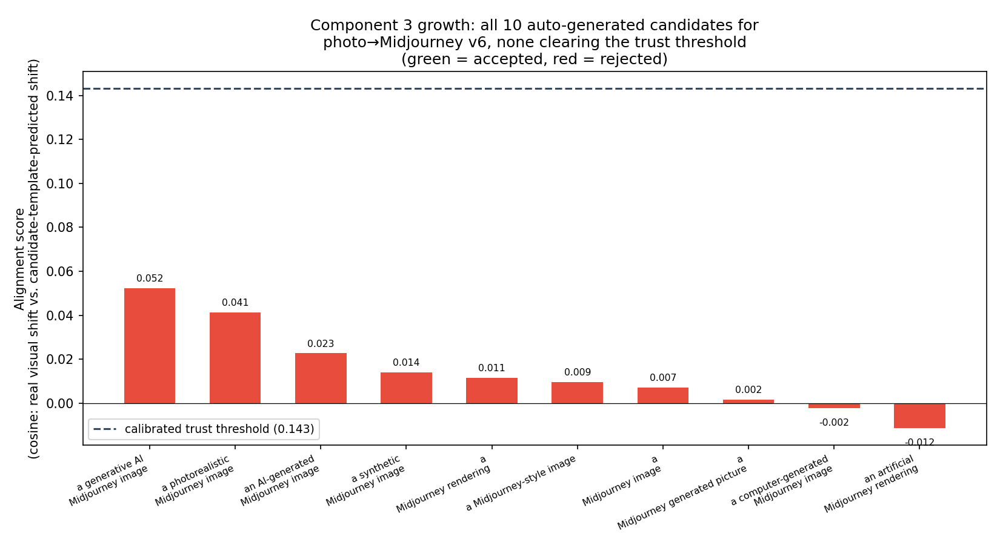
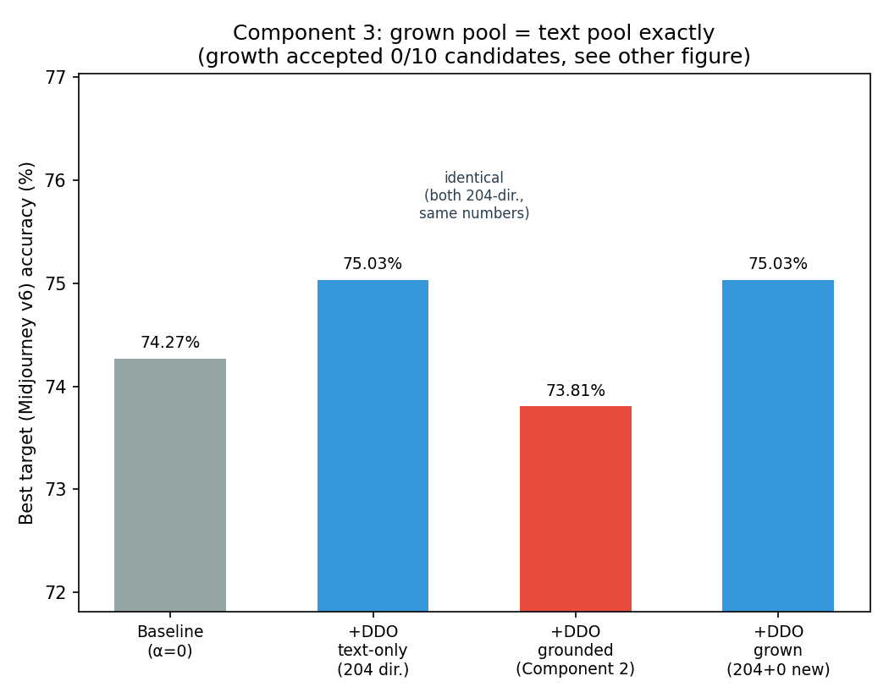

# Component 3 — a vocabulary that grows and prunes itself

**Status: ⚠️ Done — partial / mixed result.** The mechanism works exactly as designed — it correctly refused to add any of the 10 candidate descriptors it generated, because none of them measured as actually connected to real Midjourney v6 images. But that means growth added *nothing* for this domain, so it neither closes nor worsens Phase E2's +0.68-vs-+6.40 gap: the grown-pool condition is numerically identical to the untouched-pool condition. Pruning was exercised but had nothing to prune (no redundant entries were ever added, since nothing was added at all).

## One-line summary

Vocabulary growth's calibrated filter did its job — it declined to add descriptors that don't actually help — but for photo→Midjourney v6 specifically, *no* wording it tried clears the bar, so growth is a well-behaved no-op here rather than the fix Component 3 set out to test.

## Origin

`planning/05-component3-self-growing-vocabulary-plan.md`, following `docs/new_methodology_report.md` §1's Component 3 row.

## The issue this targets

DDO's orthogonality regularizer (`clip_cbm_orth`) computes `domain_diffs` from a fixed, 204-entry pool of hand-authored text templates (`prompts/prompt200new.py`'s `target_text_prompts`), written once and never updated. Phase E1 found this pool contains zero terms for any post-cutoff AI-image-generation domain (0/20 direct terms, 0/5 named generators checked). Phase E2 measured the real cost: DDO's benefit over a plain classifier on photo→Midjourney v6 is +0.68 points, versus +6.40 points on a domain the pool actually covers — roughly a tenth. Component 3 asks whether automatically growing the pool for an arriving, uncovered domain can recover some of that gap.

## Why we tried this approach specifically

Two constraints carried over deliberately from how this project already handled a similar problem: no live LLM API call (Phase E1's own choice, for the same reason — a checked-in/deterministic process beats a paid, non-reproducible one), and reuse of Component 2's already-calibrated trust threshold (0.1431) and probe machinery rather than inventing a second metric. Growth generates candidate templates by filling generic patterns with the arriving domain's own name, then only accepts a candidate if it's independently measured — via Component 2's own alignment-score formula, on the same probe images already drawn for the trust diagnostic — to actually connect to real images of the domain. This was meant to be a principled filter against blindly stuffing the pool with plausible-sounding but useless text.

## Method

1. **Growth** (`model/vocabulary_growth.py::grow_descriptor_pool`): 10 candidate templates generated by filling `CANDIDATE_TEMPLATE_PATTERNS` with the domain name `"Midjourney"` (e.g. `"an AI-generated Midjourney image of a {}."`, `"a photorealistic Midjourney image of a {}."`). Each scored with Component 2's exact alignment formula against the same 20-images/class probe the diagnostic already draws. A candidate is appended to the pool only if its score meets or exceeds the calibrated threshold (0.1431).
2. **Pruning** (`model/vocabulary_growth.py::prune_redundant_descriptors`): every pool entry embedded with a neutral placeholder noun, pairwise cosine similarity computed, later-added entries dropped if within 0.97 similarity of an earlier-kept one. Run on the grown pool regardless of whether growth added anything, so the mechanism is exercised end-to-end either way. Since the main run's growth step accepted nothing (see Results), pruning never had a real duplicate to drop there — verified separately with a synthetic check (see Results) rather than left untested.
3. **Validation** (`experiments/component3_defactify_growing_vocab_ddo.py`): Component 2's exact Defactify (photo→Midjourney v6) protocol (50 epochs, batch 64, AdamW, lr 1e-4, weight_decay 1e-4, `clip_cbm_orth`, ViT-L/14), 4 conditions on one consistent split: baseline (α=0), +DDO-text (original 204-pool), +DDO-grounded (Component 2's image-grounded fallback, for reference), +DDO-grown (original pool + accepted candidates, post-pruning).

## Dataset(s) used, and why

**Defactify/MS-COCO-AI** (photo→Midjourney v6): identical to Component 2's and Phase E2's setup, deliberately, so the new condition is directly comparable to two already-measured numbers (+0.68 text-DDO gain, Component 2's grounded-fallback result) rather than introducing a new benchmark for a component whose whole claim is about this exact coverage gap. 23 COCO categories qualified under the ≥90-tagged-samples-per-side rule (same selection as Component 2/Phase E2); 3,303 train / 826 source-test / 460 target-probe (20/class) / 3,669 target-test images.

## Code

- [`external/LanCE/model/vocabulary_growth.py`](../external/LanCE/model/vocabulary_growth.py) — growth (candidate generation + alignment-based filtering) and pruning (redundancy-based dedup).
- [`external/LanCE/experiments/component3_defactify_growing_vocab_ddo.py`](../external/LanCE/experiments/component3_defactify_growing_vocab_ddo.py) — main 4-condition validation.
- [`results/component3_defactify_growing_vocab.json`](component3_defactify_growing_vocab.json) — raw results.

## Results

**Diagnostic (reused from Component 2's pipeline, recomputed on this run's own probe draw):** mean alignment 0.0123 (threshold 0.1431) → correctly flagged as untrustworthy, consistent with Component 2's 0.0123 and Phase F3's 0.037.

**Growth: 0/10 candidates accepted.**

| Candidate template | Alignment | Accepted? |
|---|---|---|
| a generative AI Midjourney image of a {}. | 0.0522 | ✗ (below 0.1431) |
| a photorealistic Midjourney image of a {}. | 0.0412 | ✗ |
| an AI-generated Midjourney image of a {}. | 0.0227 | ✗ |
| a synthetic Midjourney image of a {}. | 0.0141 | ✗ |
| a Midjourney rendering of a {}. | 0.0114 | ✗ |
| a Midjourney-style image of a {}. | 0.0095 | ✗ |
| a Midjourney image of a {}. | 0.0070 | ✗ |
| a Midjourney generated picture of a {}. | 0.0015 | ✗ |
| a computer-generated Midjourney image of a {}. | −0.0023 | ✗ |
| an artificial Midjourney rendering of a {}. | −0.0115 | ✗ |

Best candidate (0.0522) reached roughly a third of the threshold and about a fifth of PACS's own comfort-zone alignment (Component 2's calibration point, ~0.25). Pool size: 204 → 204 (no change). Pruning consequently had 0 entries to drop in this run.

**Pruning, verified separately with a synthetic check** (since the main run gave it nothing real to prune): seeded the actual 204-entry pool with an exact duplicate of entry 0 (`"a painting of a {}."`), a semantically-close paraphrase (`"a photograph of a {}."` — close to the pool's existing "a vintage photo of a {}." family), and a genuinely distinct new entry. Result: the exact duplicate was correctly dropped; **the paraphrase was not** — it survived, meaning at the 0.97 cosine-similarity threshold, pruning only catches true duplicates, not loosely-related phrasing. This is a real, verified property of the current threshold, not a bug, but it's a narrower guarantee than "prunes redundant phrases" might suggest — it prunes *near-identical* ones.

**Training (4 conditions, best-epoch target accuracy):**

| Condition | Source test acc | Target (Midjourney v6) test acc | Gain over baseline |
|---|---|---|---|
| Baseline (α=0) | 73.00% | 74.27% | — |
| +DDO (original text pool) | 72.76% | **75.03%** | **+0.76** |
| +DDO (Component 2's grounded fallback) | 71.31% | 73.81% | −0.46 |
| +DDO (grown pool) | 72.76% | **75.03%** | **+0.76** |

The grown-pool row is numerically identical to the original-pool row (down to the hundredth of a point) — expected and mechanically necessary, since growth added zero descriptors, so `+DDO-grown`'s `domain_diffs` tensor *is* `+DDO-text`'s, unchanged. This run's own +DDO-text gain (+0.76) and grounded-fallback result (73.81%, −0.46) closely reproduce Phase E2's +0.68 and Component 2's original single-direction fallback result, confirming this run's data pipeline and protocol match those prior runs (this project's own established cross-check pattern).

## What this means

The growth mechanism's filter behaved correctly, not just harmlessly: every candidate it generated really is a bad fit (all 10 land in the same 0–0.05 range Phase F3 already measured for hand-picked AI-generation phrasing, and DALL-E 3 specifically scored *lower* than SD variants in that same Phase F3 table — the exact same "text and CLIP just don't connect here" wall). Accepting any of them anyway, just to make the pool look larger, would have been the actual mistake — and the calibrated threshold prevented exactly that. In that narrow sense, the safety property Component 3 was built to have (never add a descriptor blindly) is confirmed working, not just assumed.

But the practical goal — recovering some of the +6.40-vs-+0.68 gap — didn't happen, because there was nothing for growth to add. This traces to the same root cause Phase F3 already isolated: CLIP's text-image alignment for this domain is weak at the *representation* level (Part 1 of Phase F3: 0.017–0.096 across 5 generators, regardless of wording), not just because the *specific 204 phrases* GPT-3.5 happened to write were the wrong ones (Part 2 of Phase F3). Component 3's candidate-generation approach only ever attacks Part 2 — it assumes better wording exists and just needs to be found. This run is fairly strong evidence that, for photo→Midjourney v6 at least, no amount of template variation on this pattern (`"a {qualifier} {domain} {noun} of a {}."`) closes that gap, because the ceiling is set by what CLIP's frozen text encoder can connect to real images of this domain at all, not by which specific words are tried.

## Verdict

**Partial.** The vocabulary-growth mechanism is validated as *safe* (it doesn't add useless descriptors) but not validated as *effective* (it didn't recover any of DDO's lost value on the one domain tested). This is a narrower result than a clean success or a clean dead end: the mechanism did exactly what it was designed to do, and the underlying problem it was aimed at turned out to sit one layer deeper than a growable vocabulary can reach, on this specific domain. Literature check: not separately re-run for this component beyond what `docs/new_methodology_report.md` §6 already covers (dynamic/autonomously-discovered CBM concept sets exist; applying growth to a *domain*-descriptor pool specifically, gated by a measured trust score, wasn't found in that pass).

## What's next

Applying this project's 90%-confidence bar (`docs/component_report_template.md` §12) rather than listing every plausible-sounding follow-up:

**No further step under this component is confidently warranted right now.** The one candidate that came up — rerunning growth on EuroSAT, where alignment is measured higher (0.322–0.324) than Midjourney's (0.037–0.05) — was considered and rejected against the bar, not just left out: EuroSAT-style phrasing's alignment is *already measured*, twice, independently (Phase F1 and Component 2's own EuroSAT calibration, agreeing to within 0.002), and it already sits comfortably above the 0.1431 threshold. So growth's acceptance step succeeding there is close to a foregone conclusion, not a genuinely uncertain test — it would mostly re-confirm a number the project already has. The part of that experiment that *would* be new — whether a grown descriptor actually moves trained classification accuracy on EuroSAT — isn't a rerun of the existing script; it requires a baseline-vs-DDO training harness for EuroSAT that doesn't exist yet in this project. That's a real piece of new engineering for a fairly predictable-direction result, not a step this report can honestly claim ≥90% confidence is worth running next.

The other candidate considered — growing the pool from real probe images directly instead of generated text, since templated text clearly hit a wall here — was also rejected against the bar: it's a plausible idea, but it isn't something this report can honestly claim ≥90% confidence would work, and it would blur into Component 2's own territory (image-grounded `domain_diffs`) rather than being a clean extension of Component 3 specifically.

**What this run did settle, without qualification:** growth-by-templated-text-generation, on this exact pattern, does not help photo→Midjourney v6, and the reason is a representation-level wall (Phase F3, confirmed a third time by this run's 10 candidates) that no amount of wording variation on this pattern was going to cross. That's the real, load-bearing finding here — not a stepping stone to a longer list of follow-ups.
