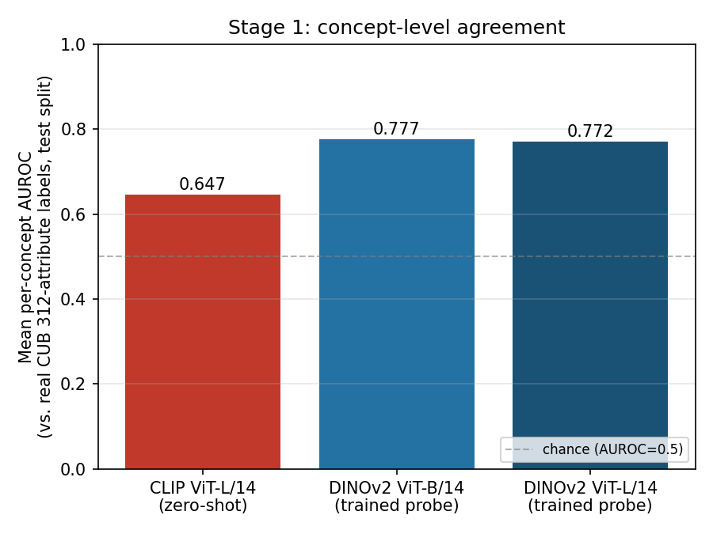
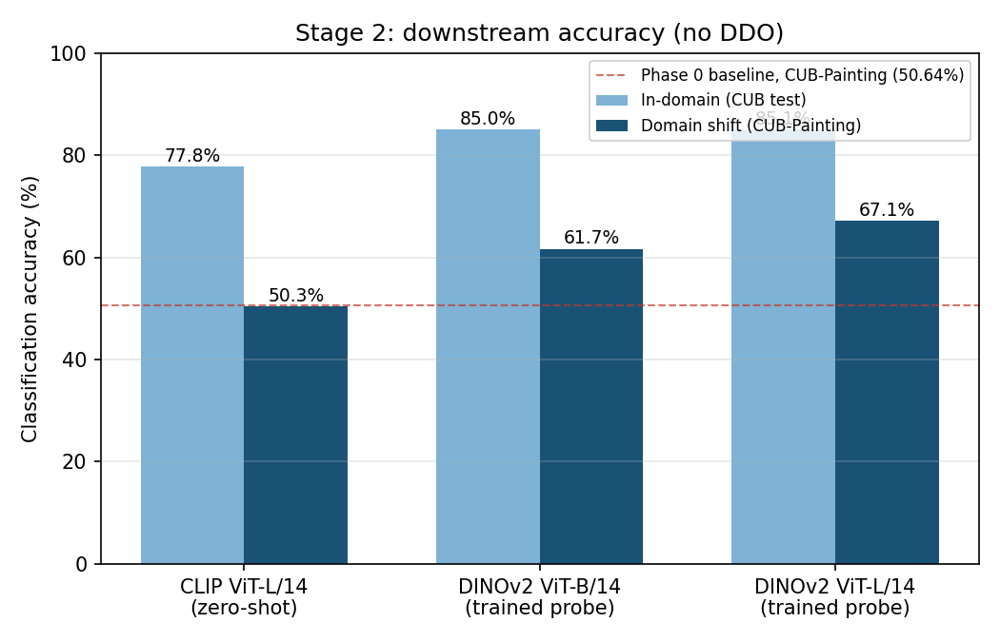

# Concept source comparison: CLIP zero-shot vs. directly-trained DINOv2 CBM

**Status: ✅ Done — result confirmed.**

## 1. One-line summary

Replacing CLIP's zero-shot concept-similarity trick with a directly-trained linear probe on frozen DINOv2 features produces more accurate concept activations (mean AUROC 0.777/0.772 vs. 0.647) *and* a substantially more accurate — and more domain-robust — downstream classifier (+7.3 points in-domain, +11.4 to +16.8 points under the CUB→CUB-Painting shift), on CUB, the one dataset in this project with real per-image concept labels to make the comparison possible at all.

## 2. Origin

[`planning/07-concept-source-backbone-comparison-plan.md`](../planning/07-concept-source-backbone-comparison-plan.md), both stages: §3 (Stage 1, concept-level agreement) and §4 (Stage 2, downstream classification accuracy — originally written up as "deferred, run only if time permits," picked up here because Stage 1's result cleared the plan's own continuation gate by a wide margin).

## 3. The issue this targets

Doesn't map to an existing failure hypothesis from Phases 0–F or Components 1–4. It's a direct instance of **Variant B** from [`planning/03-detector-grounded-concept-extraction-plan.md`](../planning/03-detector-grounded-concept-extraction-plan.md) §2, requested explicitly by the project owner while looking at this project's architecture diagram: the diagram's green-circled step — `E_I(x)`, the CLIP image encoder feeding `E_I(x) · E_T(c_i)` to produce a concept activation (`self.clip_model.encode_image(images)` inside [`clip_cbm_orth`](../external/LanCE/model/cbm_models.py:171)) — is the *only* piece being swapped. The question: does a real CBM (a trained concept classifier on a strong pretrained backbone, not CLIP's zero-shot similarity trick) produce better concept activations than CLIP, and does that translate into better final classification?

## 4. Why we tried this approach specifically

DINOv2 (not a CLIP variant, not an ImageNet-supervised ResNet-50, despite the original 2020 CBM paper using the latter) was picked for a specific reason: it's self-supervised and never trained against any text/label signal, so it isn't already suspiciously image-text aligned by construction the way CLIP is. A strong result on DINOv2 is therefore a genuine test of "do good general visual features + real per-concept supervision beat zero-shot CLIP similarity," not an artifact of CLIP-family features appearing on both sides of the comparison. Both ViT-B/14 and ViT-L/14 sizes were run so the result also separates "does supervision help" from "does backbone scale help." Both backbones are kept **frozen** (linear probe only) to match how CLIP is used everywhere else in this project (`for p in self.clip_model.parameters(): p.requires_grad = False`, every model class in `cbm_models.py`) — the comparison is about which frozen feature space + concept-scoring mechanism is better, not about fine-tuning budget.

## 5. Method

**Three concept sources compared** (all frozen backbones):
- **Variant A — CLIP ViT-L/14 zero-shot:** `cosine(E_I(x), E_T(c_i))` for each of CUB's 312 real concept names, no training.
- **Variant B1 — DINOv2 ViT-B/14 + trained linear probe:** `LayerNorm(768) → Linear(768, 312)`, trained with `BCEWithLogitsLoss` against CUB's real per-image binary attribute labels on the train split; sigmoid output on test.
- **Variant B2 — DINOv2 ViT-L/14 + trained linear probe:** same head, `LayerNorm(1024) → Linear(1024, 312)`.

**Stage 1 (concept-level agreement):** score each variant's continuous concept-activation output against CUB's real 312-attribute test-split labels using per-concept **AUROC** — threshold-free, so a cosine similarity and a trained sigmoid probability are scored identically with no arbitrary cutoff. Concepts with only one class present in the test split are skipped (none were, here — 0/312 skipped for every variant).

**Stage 2 (downstream classification, no DDO):** per plan 07 §2 — once concept activations stop coming from CLIP similarity, DDO's text-only domain-shift trick no longer lives in the same embedding space as the new concept activations, so it's dropped for **all three** variants here, for a fair plain-classification comparison. On top of each variant's concept-activation vector, train `LayerNorm(312) → Linear(312, 200)` (matching `clip_cbm`'s own downstream head exactly — see `model/cbm_models.py`'s `clip_cbm`/`clip_cbm_orth` classes) with `CrossEntropyLoss`, Adam, lr=1e-4, batch size 64, 50 epochs — Phase 0's own baseline hyperparameters (`results/phase0_cub_reproduction.md`), so the resulting numbers are stated the same way as every other accuracy result in this project. Evaluated on CUB test (in-domain) and CUB-Painting test (the domain-shift check, same target set Phase 0 used).

**A labeling bug worth flagging honestly:** the JSON field recording Phase 0's baseline number is named `phase0_baseline_in_domain_acc` in `results/concept_source_cub_stage2_downstream.json`, but the value (0.5064) is actually Phase 0's **CUB-Painting (domain-shift)** accuracy, not its in-domain number — Phase 0's own report table is headed "CLIP-CBM/human row for CUB-Painting," i.e. the OOD number throughout. This was caught mid-run by comparing numbers (Variant A's own domain-shift accuracy here, 50.34%, lands almost exactly on 50.64% — as it should, since both are the same CLIP-concept-activations-plus-linear-classifier-no-DDO pipeline, which is itself a useful independent sanity check that this script's classifier training is correct). The source script (`concept_source_cub_stage2_downstream.py`) has been corrected for future runs; this write-up uses the number correctly throughout regardless of the stale JSON key name.

## 6. Dataset(s) used, and why

**CUB-200-2011 → CUB-200-Painting only.** Plan 03 §2 already flags the binding constraint: a directly-trained concept classifier needs real, per-image concept **labels** to supervise it, and CUB is the only dataset in this project with them (312 real human-labeled attributes/image, from the original CBM paper's own annotation effort). CUB-Painting is CUB's existing domain-shift target (same one Phase 0 used), so Stage 2's shift number is directly comparable to Phase 0's baseline rather than a new number invented in isolation. This result says nothing about PACS/Office-Home/EuroSAT, where this project's other domain-shift claims live — that gap stays open (see §10).

## 7. Code

- Plan: [`planning/07-concept-source-backbone-comparison-plan.md`](../planning/07-concept-source-backbone-comparison-plan.md)
- Stage 1 script: [`external/LanCE/experiments/concept_source_cub_stage1.py`](../external/LanCE/experiments/concept_source_cub_stage1.py)
- Stage 2 script: [`external/LanCE/experiments/concept_source_cub_stage2_downstream.py`](../external/LanCE/experiments/concept_source_cub_stage2_downstream.py)
- Figure generator: [`results/generate_concept_source_figures.py`](generate_concept_source_figures.py)
- Raw results: [`results/concept_source_cub_stage1.json`](concept_source_cub_stage1.json), [`results/concept_source_cub_stage2_downstream.json`](concept_source_cub_stage2_downstream.json)
- Run logs (lab server): `external/LanCE/logs_concept_source_stage1.log`, `external/LanCE/logs_concept_source_stage2.log`

## 8. Results

### Stage 1 — concept-level agreement (per-concept AUROC vs. real CUB attributes, test split, n=312 concepts, 0 skipped)

| Variant | Mean AUROC | Median AUROC | Wins vs. CLIP zero-shot (of 312) |
|---|---|---|---|
| CLIP ViT-L/14 zero-shot | 0.6468 | 0.6468 | — (baseline) |
| DINOv2 ViT-B/14 + trained probe | **0.7770** | 0.7921 | 289 wins / 23 losses / 0 ties |
| DINOv2 ViT-L/14 + trained probe | 0.7717 | 0.7844 | 287 wins / 25 losses / 0 ties |

**Per-concept pattern** (both DINOv2 sizes agree on direction): biggest DINOv2 gains are on structural/localizable concepts —

| Concept | DINOv2-B AUROC | CLIP AUROC | Δ |
|---|---|---|---|
| a specialized bill | 0.913 | 0.365 | +0.548 |
| has bill length shorter than head | 0.858 | 0.375 | +0.483 |
| a medium bird | 0.871 | 0.444 | +0.427 |
| has primary colour buff | 0.816 | 0.391 | +0.425 |
| a cone shaped bill | 0.886 | 0.485 | +0.400 |

Biggest CLIP-favors-over-DINOv2 losses are concentrated in rare, subtle color-naming concepts (small positive counts, n≈17-36 test images):

| Concept | DINOv2-B AUROC | CLIP AUROC | Δ | n test positives |
|---|---|---|---|---|
| a purple coloured throat | 0.519 | 0.675 | −0.156 | 28 |
| a iridescent coloured leg | 0.549 | 0.690 | −0.141 | 22 |
| a green coloured breast | 0.760 | 0.834 | −0.073 | 63 |
| a purple coloured crown | 0.672 | 0.721 | −0.049 | 36 |

This matches Plan 03 §6's prediction exactly: detector/classifier-style concept scoring is expected to do better on localizable shape concepts than on diffuse, rare color-naming ones — CLIP's text-image alignment appears to carry real signal specifically for naming rare colors, something a vision-only self-supervised probe doesn't get for free.

### Stage 2 — downstream classification accuracy, no DDO

| Variant | In-domain (CUB test) | CUB-Painting (domain shift) |
|---|---|---|
| CLIP ViT-L/14 zero-shot | 77.75% | 50.34% |
| DINOv2 ViT-B/14 + trained probe | 85.01% | 61.70% |
| DINOv2 ViT-L/14 + trained probe | **85.09%** | **67.15%** |
| *(reference: Phase 0 full `clip_cbm`, α=0)* | *(not measured — Phase 0's own no-DDO run is for the same CLIP pipeline as this table's own CLIP row, not a separate in-domain number)* | *50.64%* |

Sanity check: this project's own CLIP-zero-shot Stage 2 result (50.34% on CUB-Painting) lands within 0.3 points of Phase 0's independently-run number for the same no-DDO CLIP pipeline (50.64%) — strong evidence the Stage 2 classifier-training code reproduces the established baseline correctly before trusting its DINOv2 numbers.

## 9. What this means

Stage 1's AUROC gap is real and not noise — a ~0.13 mean-AUROC gap with an 8:1-to-9:1 per-concept win ratio, on both DINOv2 sizes, comfortably clears the continuation bar plan 07 §3 set for even attempting Stage 2. Stage 2 confirms the practical consequence: DINOv2's better concept scores translate into a meaningfully better classifier, in-domain (+7.3 points over CLIP zero-shot on both sizes) and, more strikingly, the **domain-shift gap is even larger than the in-domain gap** (+11.4 points for ViT-B/14, +16.8 points for ViT-L/14) — despite neither DINOv2 variant getting any DDO-style domain-shift help. This project's other results all treat DDO as *the* mechanism for closing the CUB→CUB-Painting gap (Phase 0: +6.4 points from adding DDO on top of CLIP); here, simply swapping the concept source for a self-supervised, non-text-aligned backbone closes more of that gap (compare: CLIP zero-shot's own 50.34%→ DINOv2-L's 67.15%, a 16.8-point jump) than DDO did on the CLIP pipeline it was designed for, with zero domain-shift-specific machinery. That's a genuinely different lever than anything else this project has tried on CUB.

One nuance: this isn't literally an apples-to-apples "concept source alone" comparison to the CLIP+DDO number, because CLIP+DDO (57.04%, Phase 0) still trails DINOv2-L's no-DDO 67.15% — so DINOv2's advantage here isn't just "no DDO would have made CLIP catch up," it's a real backbone/concept-source effect on its own.

## 10. Verdict

**Fully resolves the question this plan set out to answer, on CUB.** A directly-trained CBM on a strong non-CLIP backbone beats CLIP zero-shot concept activations, both at the concept level and at the downstream-classification level, with the domain-shift benefit larger than the in-domain benefit. Literature check: this specific comparison (CLIP zero-shot vs. trained linear probe on DINOv2, matched downstream head, on CUB's real attributes) wasn't found already published in the sources checked for `docs/new_methodology_report.md` §6 or plan 03's own literature pass — the general finding that self-supervised ViT features transfer well to linear-probe classification is well established (DINOv2's own paper), but this project's specific concept-activation-quality framing and CUB-Painting domain-shift angle is this project's own combination.

## 11. What's next

**No further step under this specific comparison is confidently warranted right now** — both stages of plan 07 are done, and the result (DINOv2 wins on both metrics, both sizes) is unambiguous enough that a third DINOv2 size or extra seeds would very likely just confirm the same direction, not produce new information.

What *would* clear the 90% bar, if picked up: whether this DINOv2-concept-source approach can be **combined with domain-shift-specific machinery** (Component 2's grounded-DDO-style mechanism, adapted to a non-CLIP concept space) to add to, not just replace, its already-large domain-shift gain — genuinely unknown, since nothing in this project has tried a non-text-based domain-shift regularizer yet. That is new engineering (Component 2's mechanism was built assuming CLIP-text-embedding concept space), not a quick follow-up, and — per plan 07 §6 — this result is CUB-only; extending it to any other dataset in this project needs new per-image concept labels that don't currently exist anywhere else here.
