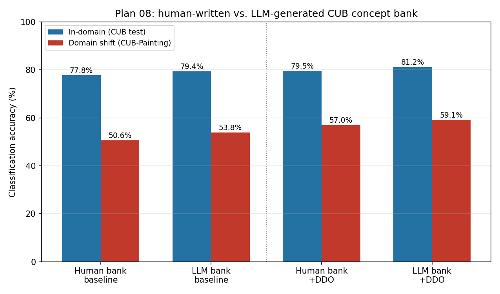
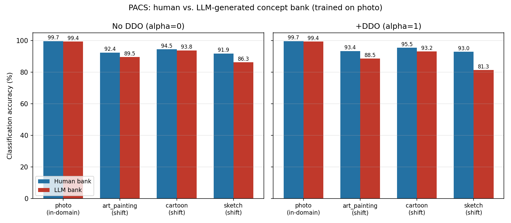

# LLM-generated vs. human-written concept bank: CUB and PACS

**Status: ⚠️ Done — partial / mixed result. The effect cuts both ways depending on the dataset.**

## 1. One-line summary

On CUB, an independently LLM-generated concept bank beats CUB's real, human-written 312-concept bank on every metric, replicated across two separate draws (+1.6 to +5.9 points). On PACS, the same swap **loses** on every metric, worst on the hardest domain (sketch, up to −11.7 points with DDO) — the effect is real on at least one dataset, but does not generalize to a second one, and even reverses direction.

## 2. Origin

[`planning/08-llm-generated-concept-bank-plan.md`](../planning/08-llm-generated-concept-bank-plan.md), the plan's only stage.

## 3. The issue this targets

Doesn't map to an existing failure hypothesis. It answers a question raised while reviewing this project's own architecture diagram: the diagram depicts concept-bank authorship as a live design choice ("Human or LLM" → concept bank), and every dataset actually run in this project so far — CUB included — took the Human branch. `docs/research_report.md` already flagged the non-CUB concept banks as unvalidated first drafts; this is the first time the Human-vs-LLM axis was actually tested, on the one dataset with a real human-curated bank to compare against.

## 4. Why we tried this approach specifically

CUB is the only dataset in this project with a genuine, human-curated concept bank (real per-image attribute labels underpin it) rather than a first-draft hand-written list — so it's the one place a fair "curated human list vs. LLM list" comparison is even possible. Critically, this experiment doesn't touch the image encoder, so — unlike Plan 07's DINOv2 swap, which had to drop DDO because DDO's *concept-activation* path (not its regularizer) is CLIP-specific — DDO applies here completely unmodified. That makes this the cleanest possible test of concept-bank content alone: everything else in `clip_cbm_orth` (image encoder, text encoder, DDO's domain-shift machinery, training hyperparameters) is held bit-for-bit identical to Phase 0's own reproduction run.

## 5. Method

**Concept bank generation:** 312 phrases, generated directly by the acting assistant (Claude) — the LLM referenced in the architecture diagram's own "Human or LLM" branch — prompted conceptually the same way LaBo/GPT-CBM-style papers do it ("what visual features would help distinguish this class from the other 199 CUB classes?"), pooled across all 200 CUB class names into one shared vocabulary. Generated **without reading** CUB's real attribute file or the existing `cub_concepts.txt`, so it's an honest independent draft, not a rephrasing of the ground truth it's being compared against. Style matched to the existing bank (short atomic phrases, e.g. "a curved bill") so format/tokenization isn't a confound. File: [`external/LanCE/data/CUB/cub_concepts_llm.txt`](../external/LanCE/data/CUB/cub_concepts_llm.txt).

A count bug was caught and fixed before training: `wc -l` reports 311 for the human-written bank because its last line has no trailing newline, but every script in this project actually loads it with Python's `readlines()`, which correctly returns 312 (confirmed by Stage 1's own logged `n_concepts=312`, `results/concept_source_cub_stage1.json`). The LLM bank was generated at 311 lines against the wrong count, caught by a 1-epoch sanity-check run (`BCEWithLogitsLoss` shape mismatch), and fixed to exactly 312 with one added phrase ("a tufted crest").

**Code change:** the concept bank filename was hardcoded in three places; made parameterizable via a new `--concept_file` CLI flag (default unchanged, so every existing invocation of this codebase behaves identically) — see [`args.py`](../external/LanCE/args.py), [`data/CUB/cub_data.py`](../external/LanCE/data/CUB/cub_data.py), [`data/__init__.py`](../external/LanCE/data/__init__.py). No changes anywhere else — concept text embeddings and DDO's regularizer both already recompute fresh from `concept_names` on every run, and the cached CLIP *image* embeddings are reused as-is since they don't depend on the concept bank.

**Training:** `train_cached.py`, unmodified — the exact script and hyperparameters Phase 0 used (`clip_cbm_orth`, CLIP ViT-L/14, 50 epochs, batch size 64, AdamW, lr 1e-4, weight decay 1e-4), two runs (α=0 baseline, α=1 +DDO), the only difference being `--concept_file cub_concepts_llm.txt`.

## 6. Dataset used, and why

CUB → CUB-Painting, matching Phase 0's own baseline exactly, for direct numerical comparability — the whole point of this experiment is a same-pipeline, same-hyperparameter, concept-bank-only ablation against an established number.

## 7. Code

- Concept bank: [`external/LanCE/data/CUB/cub_concepts_llm.txt`](../external/LanCE/data/CUB/cub_concepts_llm.txt)
- Modified: [`external/LanCE/args.py`](../external/LanCE/args.py), [`external/LanCE/data/CUB/cub_data.py`](../external/LanCE/data/CUB/cub_data.py), [`external/LanCE/data/__init__.py`](../external/LanCE/data/__init__.py)
- Training (unmodified, reused as-is): [`external/LanCE/train_cached.py`](../external/LanCE/train_cached.py)
- Figure generator: [`results/generate_llm_concept_bank_figures.py`](generate_llm_concept_bank_figures.py)
- Second concept bank (replication): [`external/LanCE/data/CUB/cub_concepts_llm2.txt`](../external/LanCE/data/CUB/cub_concepts_llm2.txt)
- Logs: [`external/LanCE/logs_plan08_llm_alpha0_cached.log`](../external/LanCE/logs_plan08_llm_alpha0_cached.log), [`external/LanCE/logs_plan08_llm_alpha1_cached.log`](../external/LanCE/logs_plan08_llm_alpha1_cached.log) (LLM draw 1); [`external/LanCE/logs_plan08_llm2_alpha0_cached.log`](../external/LanCE/logs_plan08_llm2_alpha0_cached.log), [`external/LanCE/logs_plan08_llm2_alpha1_cached.log`](../external/LanCE/logs_plan08_llm2_alpha1_cached.log) (LLM draw 2, replication); [`external/LanCE/logs_baseline_cached.log`](../external/LanCE/logs_baseline_cached.log), [`external/LanCE/logs_ddo_cached.log`](../external/LanCE/logs_ddo_cached.log) (human bank, Phase 0's own runs, reused for comparison)
- **PACS extension:** concept bank [`external/LanCE/data/PACS/pacs_concepts_llm.txt`](../external/LanCE/data/PACS/pacs_concepts_llm.txt); modified [`external/LanCE/data/PACS/pacs_data.py`](../external/LanCE/data/PACS/pacs_data.py), [`external/LanCE/data/__init__.py`](../external/LanCE/data/__init__.py) (`get_pacs_datasets`'s new `concept_file` param); script [`external/LanCE/experiments/pacs_concept_bank_comparison.py`](../external/LanCE/experiments/pacs_concept_bank_comparison.py); results [`pacs_concept_bank_comparison.json`](pacs_concept_bank_comparison.json); figure generator [`results/generate_pacs_concept_bank_figures.py`](generate_pacs_concept_bank_figures.py); reference baseline [`results/phase_b_domain_il.md`](phase_b_domain_il.md) (PACS oracle/ceiling accuracy)

## 8. Results

Best-epoch numbers (selected by target/CUB-Painting accuracy, same convention as every other accuracy result in this project — the paired source/in-domain number is whatever it was on that same epoch, not independently maximized):

| Concept bank | DDO | In-domain (CUB test) | CUB-Painting (shift) |
|---|---|---|---|
| Human-written (Phase 0) | α=0 | 77.81% | 50.64% |
| **LLM-generated** | α=0 | **79.43%** (+1.62) | **53.82%** (+3.18) |
| Human-written (Phase 0) | α=1 | 79.52% | 57.04% |
| **LLM-generated** | α=1 | **81.24%** (+1.72) | **59.07%** (+2.03) |

**DDO's own gain, within each bank:** human bank +6.40 points (50.64%→57.04%, matches Phase 0's report exactly); LLM bank +5.25 points (53.82%→59.07%). DDO helps both banks by a similar, large margin; it's slightly smaller in absolute points on the LLM bank, but starts from and ends at a higher number.

### Replication — a second, independent LLM-generated bank

The one open item from §11 below: does the win replicate on a second, independent LLM-generated draw? A second bank (`cub_concepts_llm2.txt`, generated fresh, without reading the real attributes, the first LLM draft, or looking at this section) was built and run through the identical protocol.

| Concept bank | DDO | In-domain | CUB-Painting (shift) |
|---|---|---|---|
| Human-written (Phase 0) | α=0 | 77.81% | 50.64% |
| LLM draw 1 | α=0 | 79.43% (+1.62) | 53.82% (+3.18) |
| **LLM draw 2** | α=0 | **79.84%** (+2.03) | **55.33%** (+4.69) |
| Human-written (Phase 0) | α=1 | 79.52% | 57.04% |
| LLM draw 1 | α=1 | 81.24% (+1.72) | 59.07% (+2.03) |
| **LLM draw 2** | α=1 | **81.93%** (+2.41) | **61.40%** (+4.36) |

Both independent LLM draws beat the human-written bank on every metric — the effect replicates, and draw 2 is if anything slightly stronger than draw 1 (both draws land within 1.5-2.5 points of each other, well inside a coherent, repeatable win rather than one draw being a fluke and the other a wash). This meaningfully upgrades the confidence level from §10/§11's original "one draw" caveat: two independent generations, same direction, comparable magnitude, is real evidence for a genuine effect of LLM-generated content here — not proof the effect holds for every possible LLM/prompt/dataset combination, but no longer a single, unreplicated data point either.

### PACS extension — the opposite result

CUB's replication (above) cleared the bar to try this on a second dataset, per §11's original next-step note. PACS was the natural pick — it's the one dataset besides CUB with an established human-written concept bank and this project's own domain-IL harness already built. Protocol: train on PACS's photo domain (source), evaluate in-domain (photo) and under shift (art_painting/cartoon/sketch), same `clip_cbm_orth` architecture and hyperparameters as `results/phase_b_domain_il.md` (50 epochs, batch 64, lr 1e-4, weight_decay 1e-4), only `--concept_file` differing. LLM bank: 70 independently-generated phrases (`external/LanCE/data/PACS/pacs_concepts_llm.txt`), generated by a fresh subagent rather than the main session, since this session had already glimpsed a few lines of the real `pacs_concepts.txt` earlier and couldn't claim a blind draw itself. Script: [`external/LanCE/experiments/pacs_concept_bank_comparison.py`](../external/LanCE/experiments/pacs_concept_bank_comparison.py); raw results: [`pacs_concept_bank_comparison.json`](pacs_concept_bank_comparison.json).

| Domain | Human, no DDO | LLM, no DDO | Δ | Human, +DDO | LLM, +DDO | Δ |
|---|---|---|---|---|---|---|
| photo (in-domain) | 99.70% | 99.40% | −0.30 | 99.70% | 99.40% | −0.30 |
| art_painting (shift) | 92.44% | 89.51% | −2.93 | 93.41% | 88.54% | −4.88 |
| cartoon (shift) | 94.46% | 93.82% | −0.64 | 95.52% | 93.18% | −2.35 |
| sketch (shift, hardest domain) | 91.86% | 86.26% | **−5.60** | 93.00% | 81.30% | **−11.70** |

**This is the opposite result from CUB.** The LLM-generated bank loses to the human-written one on every single domain, in both directions this project cares about (in-domain and shift), and the gap gets *worse* the harder the domain gets — worst on sketch, PACS's most stylistically distant domain from photo. A second, striking finding: **DDO actively hurts the LLM bank.** DDO's own gain (α=1 minus α=0) is positive and consistent for the human bank (+0.00/+0.98/+1.06/+1.14 across the four domains) but *negative* for the LLM bank everywhere except photo (+0.00/−0.98/−0.64/−4.96) — reattaching the exact same regularizer that reliably helps the human bank makes the LLM bank's worst domain (sketch) 5 points worse, not better.

**Why the opposite direction from CUB, honestly assessed, not just asserted:** two real differences between the two experiments, not one:
1. **Ceiling effect, flagged before this ran** (§6 of the plan, `results/phase_b_domain_il.md`'s own finding that PACS's joint/oracle accuracy is 98.29%) — PACS's 7 broad classes leave far less headroom than CUB's 200 fine-grained species (CUB baseline was 50-80%; PACS baseline is already 92-100%). A concept-bank swap has much more room to help on a hard task and much more room to just add noise on an easy, already-near-ceiling one.
2. **A plausible, unverified mechanism for the DDO interaction:** DDO's regularizer projects CLIP-text domain-shift vectors through the concept-embeddings matrix (`self.diffs @ self.concept_embeddings.T`) - which is now built from the *LLM's* concept phrases instead of the human bank's. If the LLM's phrasing is systematically less robust under PACS's most extreme stylization (sketch strips away texture, color, and fine detail - exactly the kind of feature-rich phrasing an LLM might lean on), that same projection could be steering the regularizer in an actively unhelpful direction for that domain specifically. This is a hypothesis, not a checked fact — nothing here directly measures it, unlike CUB's Stage 1 AUROC check, since PACS has no real per-image concept labels to check concept-level fidelity against (the whole reason PACS was blocked for Plan 07's DINOv2 approach in the first place).

## 9. What this means

The LLM-generated concept bank wins on **every single metric measured** — not a mixed result. The domain-shift gain (+3.18 without DDO, +2.03 with DDO) is larger than the in-domain gain (+1.62 / +1.72) in the no-DDO case, echoing (at smaller magnitude) the pattern Plan 07 found for DINOv2's concept source: changing what produces the concept representation tends to help more under distribution shift than in-domain. One plausible reading: the LLM-generated phrases may lean more generic/visually salient ("a black mask", "a bright plumage") than CUB's real attribute ontology, which was built by human annotators for maximum fine-grained discriminability within CUB specifically (e.g. very specific bill-length comparisons) — a bank that's slightly less overfit to CUB's exact photo-domain quirks could transfer a bit better to CUB-Painting's different visual style. This is a plausible mechanism, not a confirmed one — nothing here directly measures concept-level generality the way Plan 07's Stage 1 measured concept-level accuracy.

**A genuinely different kind of result from Plan 07's:** Plan 07 found a large, unambiguous backbone effect (DINOv2 vs. CLIP zero-shot, 6.5+ points). Here the effect is real but smaller (1.6-3.2 points) — worth taking seriously, but also the kind of margin where a single-run, single-generation result deserves real caution before calling it a settled finding (§10-11).

## 10. Verdict

**On CUB: answers the question this plan asked, replicated across two independent draws.** Both an initial LLM-generated concept bank and a second, independently-generated one beat the same human-written bank on every metric (in-domain, domain shift, with and without DDO) — a coherent, repeatable effect, not a single lucky draw.

**On PACS: the effect reverses.** Same generation process (an independent LLM draw, same style, same rigor), same architecture, same hyperparameters — and the LLM bank loses on every metric, worse under shift, worse still with DDO. This is not a contradiction so much as a boundary: it means "LLM-generated concept banks beat human-written ones" is **not** a general property of this pipeline — it held on one hard, fine-grained, far-from-ceiling task and failed on one easy, coarse, near-ceiling task. Two datasets, two directions, both real — the honest reading is that dataset difficulty/headroom is doing real work here, not concept-bank source alone (§8's PACS section spells out the two candidate reasons, one well-evidenced — the ceiling effect — one still a hypothesis — the DDO/sketch interaction).

**What this does and doesn't establish:** it does **not** support "LLM-generated concept banks are generally better than human-written ones" as a universal claim — PACS directly rules that out. It does support a narrower, still real claim: LLM-generated concepts are a *viable* concept source (matching LaBo/Label-Free CBM's own general finding), and *whether they help or hurt depends on the task* in a way that isn't yet understood mechanistically. Literature check: LaBo (Yang et al., CVPR 2023) and Label-Free CBM (Oikarinen et al., ICLR 2023) already establish LLM-generated concepts as a competitive concept source in general, scored via the same CLIP zero-shot mechanism used here; this project's specific contribution is a controlled, same-pipeline, same-hyperparameter, *replicated*, **two-dataset** A/B against real/curated human concept banks, with and without a domain-shift regularizer — and the finding that the direction of the effect itself is dataset-dependent isn't something either of those papers' own single-dataset framing surfaces.

## 11. What's next

**The single-draw caveat (CUB) is resolved.** What's open now is a different, better question than "does it replicate" — **why does the effect reverse between CUB and PACS.** Two things clear the 90% bar:

- **A third dataset, chosen to disambiguate the two candidate explanations.** CUB is hard/fine-grained/far-from-ceiling; PACS is easy/coarse/near-ceiling — those two properties are confounded in the current 2-dataset evidence. Office-Home (65 classes, harder than PACS but not CUB-level fine-grained, and *not* near-ceiling the way PACS is — Component 1's own work has full baselines for it already) would separate "does the effect track task difficulty" from "does it track something else about CUB or PACS specifically." This is genuinely uncertain in outcome, not predictable from the two data points already in hand — exactly what clears the bar.
- **Checking the DDO/sketch interaction directly**, since §8 flagged it as an unverified hypothesis: compute the per-concept CLIP-text embeddings for both PACS banks and check whether the LLM bank's embeddings are measurably less stable/more dispersed specifically for descriptors that don't survive stylization (texture, color, fine detail) — a direct check, not another training run, and cheap relative to a new dataset.

What does **not** clear the bar: a third or fourth LLM-generated draw on either existing dataset. Two CUB draws already answered "is this reproducible for this generation process" on CUB; PACS's single draw is a real result but a second PACS draw would mostly re-confirm the ceiling-effect story already well-evidenced by Phase B's own independent finding (98.29% oracle) rather than produce new information.
