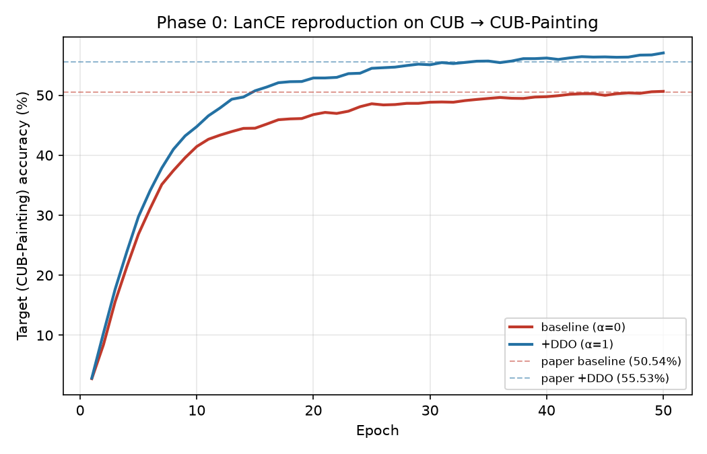
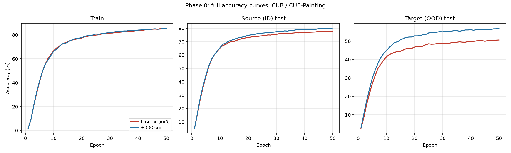

# Phase 0 — LanCE baseline reproduction (CUB / CUB-Painting)

**Status: PASS.** This gates every later phase — if this hadn't matched, nothing built on top of it would be trustworthy.

## Setup

- Model: `clip_cbm` (CLIP-CBM), CLIP ViT-L/14, human-style concept bank (`cub_concepts.txt`, 311 concepts)
- Dataset: CUB-200-2011 (source/train, official Caltech release) → CUB-200-Painting (target/OOD test, Google Drive release linked from LanCE's README)
- 50 epochs, batch size 64, Adam, lr 1e-4 — same hyperparameters as `joeyz0z/LanCE`'s README-documented training command
- Two runs: `--alpha 0` (baseline, no DDO) and `--alpha 1` (+DDO)

## Result vs. paper's Table 1 (CLIP-CBM/human row for CUB-Painting)

| | Baseline (α=0) | +DDO (α=1) |
|---|---|---|
| Paper (Table 1) | 50.54% | 55.53% |
| Our reproduction | **50.64%** | **57.04%** |
| Delta | +0.10 | +1.51 |

Both land within the plan's ~3–5 point pass bar — baseline essentially exact, +DDO slightly exceeding the paper's reported gain (+6.40 points in our run vs. +4.99 in theirs, same direction and comparable magnitude). Full epoch-by-epoch logs: `external/LanCE/logs_baseline_run.log`, `external/LanCE/logs_ddo_run.log`.

## Bugs found and fixed in `joeyz0z/LanCE`'s released code to get here

None of these touch the method itself (DDO loss, model architecture) — all are plumbing bugs that silently blocked the README's own documented commands from running:

1. **`data/__init__.py`** — missing `import os` despite using `os.path.join` throughout.
2. **`data/__init__.py`** — stray leading `/` in the CUB-Painting path join (`"/CUB/CUB-200-Painting/images"`), which breaks `os.path.join`'s path resolution. Also, the actual downloaded archive has no `images/` subdirectory (class folders sit directly under `CUB-200-Painting/`), so the path segment needed correcting, not just de-slashing.
3. **`args.py`** — `--batch_size` was typed `str` and `--epochs` was typed `float`; both broke as soon as you pass either flag on the command line (`range()` needs an int, `DataLoader` rejects a non-int batch size).
4. **`data/CUB/cub_data.py`** — `attr_label` was hardcoded to a dummy `torch.tensor([0]*77)` in both `Processed_CUB_Dataset` and `Processed_CUBP_Dataset`, but the actual concept bank has 311 concepts. Irrelevant to training outcome (`--beta`, the concept-supervision weight, defaults to 0), but `BCEWithLogitsLoss` still requires matching shapes to even compute the (discarded) loss value, so training crashed before a single step. Fixed to size dynamically off `len(self.concept2id)`.
5. **`data/__init__.py`** — the CUB branch passed `train_dataset.classname2id` for *both* the `classname2id` and `concept2id` arguments when constructing the target/painting test set, instead of the actual `train_dataset.concept2id`. Copy-paste bug; caused the same shape-mismatch crash during evaluation.
6. **`data/__init__.py`** — the function's shared final `return` statement returned `test_loader` in the slot meant for the raw `test_dataset` object (`return train_dataset, train_loader, test_loader, test_loader, ...` instead of `..., test_dataset, test_loader, ...`). Harmless for `main.py`'s own training/eval (which only ever consumed the loader), but it's why Phase 0's original log said "Source test samples: 91" — that was quietly counting *batches*, not images (5,790 images ÷ batch size 64 ≈ 91). It also meant the dataset object was never accessible for reuse, which blocked embedding caching (below) until fixed.

## Performance fix: cached embeddings

Their code recomputes CLIP image embeddings from scratch every epoch, even though CLIP is frozen and the embeddings never change — this was the dominant cost, ~7–14 minutes/epoch on an RTX 5060 8GB for ~6k CUB training images. Added `cache_utils.py` (precompute+cache embeddings once per dataset split) and `train_cached.py` (trains on the cached features via a new `forward_cached()` method added to the model, identical to `forward()` minus the redundant CLIP encode step).

**Validated numerically identical to the original pipeline:** re-running Phase 0 through `train_cached.py` reproduced *exactly* the same results — baseline 50.64% and +DDO 57.04% target accuracy, matching `main.py`'s run to the hundredth of a percent on both. Full epoch-by-epoch logs: `external/LanCE/logs_baseline_cached.log`, `external/LanCE/logs_ddo_cached.log`.

**Speed:** epoch time dropped from ~430–836 seconds to **~3 seconds** — a full 50-epoch run now takes a few minutes total (mostly the one-time embedding-caching cost) instead of hours. `train_cached.py` is the script used for all experiments from Phase A onward.

## Figures

