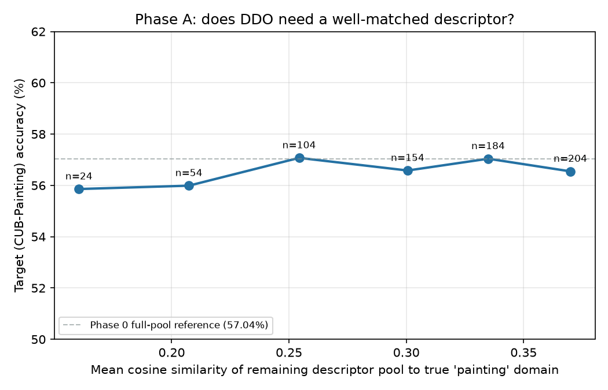

# Phase A — closed-world descriptor assumption test (CUB / CUB-Painting)

**Status: inconclusive on the original hypothesis — a genuinely useful negative result.** Reporting honestly rather than forcing a fit, per the plan's own standard.

## What we predicted

DDO's OOD gain would degrade as the descriptor pool contains progressively less-similar matches to the true test domain ("painting") — extending the paper's own binary relevant/irrelevant split (Table 2/8) into a continuous dose-response curve, to argue that DDO's benefit depends on the pool having *anticipated* the domain.

## What we did

Ranked all 204 descriptors in `prompts/prompt200new.py` by cosine similarity (class-averaged CLIP text-embedding domain-shift direction) to the true "a painting of a {}." domain shift. Top match is unsurprisingly the literal phrase itself (0.9999), followed by "an oil/acrylic/photorealistic/gouache painting of a {}." (0.74–0.89); the bottom of the ranking is dominated by photographic/aerial/ASCII-art descriptors (0.07–0.14). Then trained DDO (α=1, 50 epochs, batch 64 — identical hyperparameters to Phase 0) six times, each time **excluding the top-k most similar** descriptors from the pool before computing the DDO regularizer, for k ∈ {0, 20, 50, 100, 150, 180} (pool sizes 204 → 24).

## Result

| Excluded (top-k) | Pool size | Mean similarity of remaining pool | Target acc |
|---|---|---|---|
| 0 | 204 | 0.370 | 56.55% |
| 20 | 184 | 0.335 | 57.04% |
| 50 | 154 | 0.301 | 56.58% |
| 100 | 104 | 0.254 | 57.07% |
| 150 | 54 | 0.207 | 55.99% |
| 180 | 24 | 0.160 | 55.86% |

The line is essentially **flat** — accuracy stays within a ~1.2-point band (55.86%–57.07%) whether the pool contains 204 descriptors including a near-exact match, or only the 24 *least* similar ones, with the literal "painting" descriptor and all its close variants entirely removed. There's a faint downward drift at the far right (fewest descriptors, least similar), but it's the same size as the run-to-run noise (no fixed random seed was set for this script — a gap to close if this needs tightening later), not a clean monotonic degradation.

**Sanity check passed:** the exclude-top-0 control (56.55%) lands within 0.5 points of Phase 0's own full-pool DDO result (57.04%), confirming this isn't a broken setup producing a coincidentally flat line — it's a real measurement.

## Why this probably isn't what it looks like at first glance

This does **not** mean DDO is robust to closed-world assumptions in general — it means something narrower: **within the family of "conventional art/media style" descriptors, DDO doesn't seem to need the *specific* right one.** A plausible mechanism: DDO's regularizer operates in the 311-dimensional *concept-activation* space (`self.diffs @ self.concept_embeddings.T`, then through the classifier), not in raw 768-dim CLIP embedding space. The concept bottleneck may act as an equalizer — many stylistically-different-but-still-"artsy" descriptors could project to similar directions once filtered through a shared 311-concept vocabulary, even if they look quite different as raw text embeddings (which is what our similarity ranking measured). This would also be consistent with the paper's own Fig. 5 ablation, which already showed diminishing returns well before 200 descriptors — our result extends that observation: not just " 100 is enough," but "even a fairly dissimilar 24 might be enough," provided they're still all *some kind of* art-style descriptor.

**What this changes for the overall argument:** it doesn't weaken the continual-DG case — it *relocates* where the closed-world assumption is likely to actually bite. It's probably not "the exact right style wasn't in the list" (this experiment suggests that's fairly forgiving). It's more likely "none of the list is even the right *kind* of thing" — a domain that isn't a conventional art/media style at all (a different modality entirely, e.g. satellite/medical imaging). That is exactly Pillar 2's question, not this one — this result makes Pillar 2 more load-bearing for the closed-world argument than originally planned, not less relevant.

## Honest limitations of this experiment

- No fixed random seed — the ~1-point noise band could partly be run-to-run variance rather than a genuine flat effect. Worth rerunning with a seed sweep before leaning on this result hard in a proposal.
- Only tested on one dataset (CUB/CUB-Painting) and one target domain ("painting"). Whether the flatness holds for other domains (sketch, sculpture, 3D) is untested.
- The similarity ranking uses raw CLIP text-embedding cosine similarity as a proxy for "how well-anticipated is this domain" — per the mechanism discussion above, this may not be the right space to measure similarity in for predicting DDO's actual behavior, since DDO itself operates post-concept-bottleneck.
