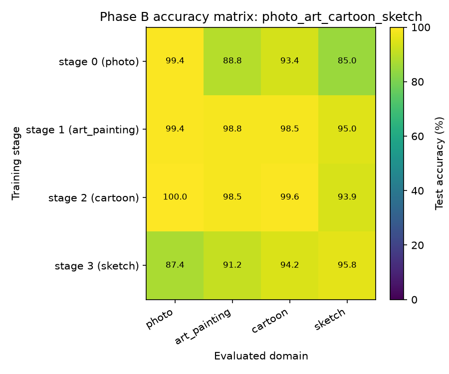
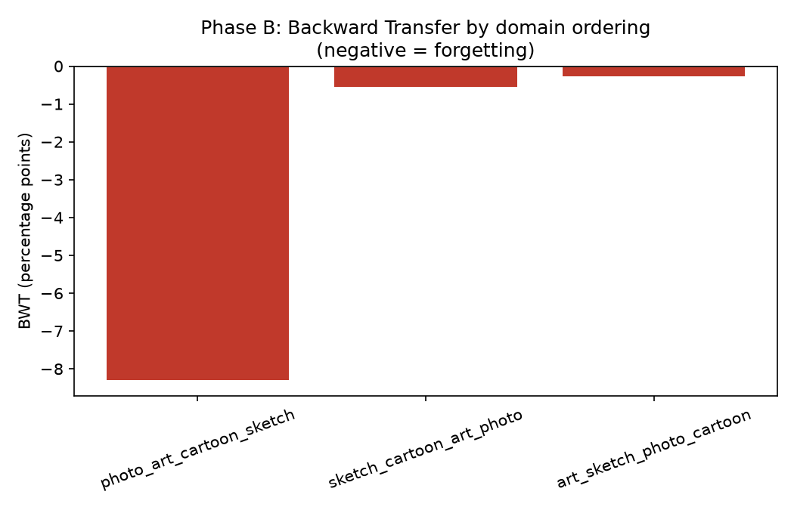
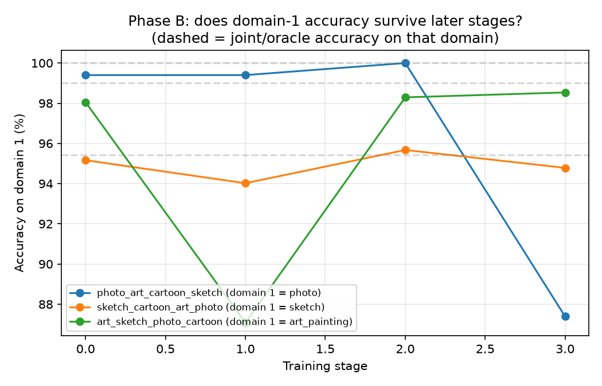
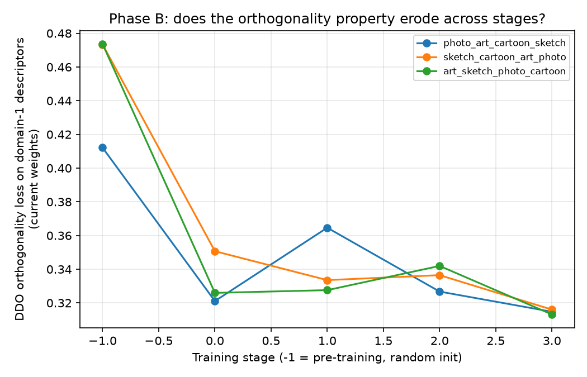

# Phase B — Domain-IL sequential forgetting probe (PACS)

**Status: the naive-sequential protocol does forget, but far less than predicted, and only for one of three domain orderings tested — a second honest, weaker-than-hypothesized result.**

## What we predicted

Sequential fine-tuning of `W_F` across PACS's 4 domains (photo → art_painting → cartoon → sketch, no replay) would show clear catastrophic forgetting: earlier-trained domains' accuracy dropping noticeably by the final stage, a meaningfully negative BWT, and the DDO orthogonality property (recomputed against domain-1's own descriptors at every stage) eroding as training moved further from the domain it was originally enforced for.

## What we did

Trained LaBO-style CLIP-CBM (`clip_cbm`, ViT-L/14, only `W_F` trainable) via the cached-embedding pipeline, on PACS (4 domains, 7 classes — dog/elephant/giraffe/guitar/horse/house/person, ~9,991 images, official kfold release, 80/20 stratified split per class/domain). Two conditions: **(a) joint/oracle** — one model trained on all 4 domains pooled; **(b) naive sequential** — one model, fresh AdamW optimizer per stage, trained on domain *i*, evaluated on all 4 domains, moved to domain *i+1* with no replay. Repeated across 3 domain orderings. 50 epochs/stage, batch 64, lr 1e-4, weight_decay 1e-4, alpha=1 — identical hyperparameters to Phase 0/A. Reported in ACC/BWT (Lopez-Paz & Ranzato) plus a per-stage mechanism metric: `|classifier[1:](domain_diffs @ concept_embeddings.T)|.mean()` using the model's own (fixed-since-construction) domain-1 descriptor diffs and the *current* classifier weights.

## Result

**Joint/oracle (non-continual upper bound): ACC = 98.29%** (photo 100%, art_painting 99.0%, cartoon 98.7%, sketch 95.4%) — PACS's 7 visually-distinct classes are an easy task for CLIP concept-activation features, unlike CUB's 200 fine-grained bird species in Phase 0.

| Domain order | ACC (final) | BWT |
|---|---|---|
| photo → art_painting → cartoon → sketch | 92.16% | **−8.30** |
| sketch → cartoon → art_painting → photo | 97.81% | −0.54 |
| art_painting → sketch → photo → cartoon | 97.96% | −0.26 |

Only the **photo-first ordering** shows real forgetting: photo accuracy holds at 99.4–100% through stages 0–2, then drops to 87.4% once the model has trained through art_painting, cartoon, and sketch — a genuine ~12-point fall below its own diagonal value and well below the joint/oracle's 100% on photo. The other two orderings stay within ~1–2 points of their diagonal values and close to oracle-level accuracy throughout; BWT for those is near zero, not the clear negative signal predicted.

The DDO-erosion metric drops sharply after stage 0 in every ordering (pre-training random-init baseline ~0.41–0.47 → ~0.32–0.35 after the first domain), then stays roughly flat and noisy — no clean continued erosion across stages 1–3 within this budget. It doesn't cleanly track the accuracy story either: photo-first's stage-3 orth loss (0.315) is actually the *lowest* of that run's stages, right when photo's accuracy is dropping hardest.

## Why this probably isn't what it looks like at first glance

PACS's 7 broad object categories give the classifier a lot of slack — near-ceiling accuracy (95–100%) across nearly every domain/stage combination means there's little room for a forgetting signal to show up as an accuracy drop, unlike a harder, more class-crowded benchmark. The one ordering that *does* show forgetting (photo trained first, evaluated last after three more domains) demonstrates the effect is real and order-sensitive exactly as the continual-learning literature predicts — but PACS's ease means most orderings don't expose it. This is consistent with Phase A's finding in spirit: the naive hypothesis (a uniform, dramatic failure mode) keeps not holding up cleanly on the first test constructed for it; the actual failure mode is narrower and more conditional than predicted, not absent.

**What this changes for the overall argument:** it doesn't retract Pillar 1's core claim — one ordering did show real, order-dependent forgetting, and Phase C's remediation tests (cumulative DDO / replay / EWC) are still meaningful to run against a signal that exists, just weaker than expected. It does mean PACS alone is a soft testbed for this claim; the Phase D stretch goal (a harder, more class-crowded benchmark like Office-Home) becomes more useful than "optional" for making the forgetting story land clearly. It also reinforces, alongside Phase A, that Pillar 2 (does the frozen CLIP backbone have coverage blind spots independent of forgetting) is carrying more of the overall argument's weight than originally planned.

## A pipeline bug found and fixed along the way

`cache_utils.py`'s CLIP-embedding caching DataLoader used `num_workers=8`. On this environment, that silently produced **identical cached image embeddings for every example** once a split needed more than a few worker-dispatched batches (reproduced deterministically on PACS's 1337-image photo/train split; a 333-image split alone didn't trigger it). This is a genuine data-pipeline bug, not a training-dynamics finding — the first full run's results were a degenerate constant-prediction artifact (accuracy exactly matching "always predict one fixed class" against each domain's true class distribution) and were discarded before writing this report. Fixed by setting `num_workers=0` (this only runs once per dataset split before caching, so the cost is one-time). Verified CUB's existing caches from Phase 0/A were unaffected (checked directly: no identical rows), so those results stand. All PACS caches were rebuilt from scratch and re-verified row-by-row before the results above were produced.

## Honest limitations of this experiment

- Only 3 of the 24 possible domain orderings were tested — the one ordering showing real forgetting could be an outlier rather than representative; a fuller permutation sweep would clarify how common the photo-first pattern's failure mode actually is.
- Single run per ordering, no seed sweep — given how close most BWT values are to zero, run-to-run noise could plausibly explain part of the difference between orderings, similar to the caveat Phase A raised about its own flat result.
- PACS's near-ceiling accuracy across most conditions limits how much room there is to observe forgetting at all — this result is as much "PACS is dataset is too easy for this feature space" as it is "DDO resists forgetting," and the two aren't yet disentangled.
- The DDO-erosion mechanism metric didn't produce a clean, interpretable trend — it may need more stages (repeating domains, or a longer sequence) before its relationship to accuracy-based forgetting becomes legible.
