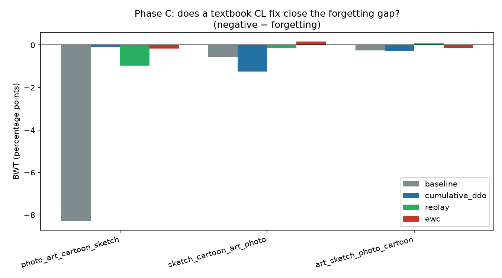
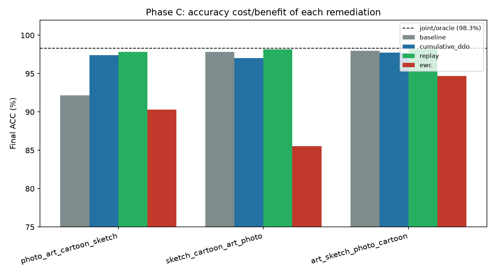
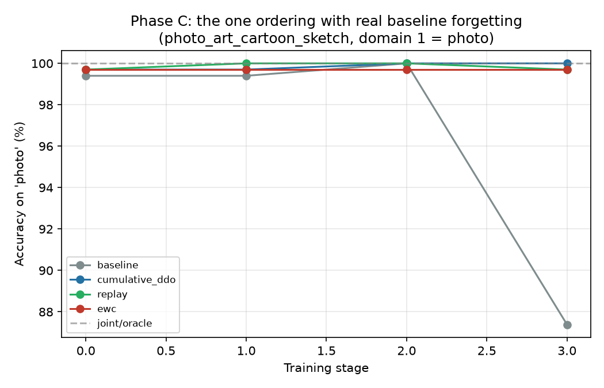

# Phase C — remediation attempts: does a textbook CL fix already solve it?

**Status: yes, mostly. Cumulative DDO and cached-embedding replay close the (already-modest) forgetting gap from Phase B at little-to-no accuracy cost; EWC also controls forgetting but at a real accuracy cost. Reported honestly per the plan's own standard — a working fix is still a useful finding.**

## What we predicted

Phase B found real but narrow forgetting: only the photo-first ordering (photo → art_painting → cartoon → sketch) showed meaningful negative BWT (−8.30); the other two orderings were already near zero. The question for Phase C was whether a standard, off-the-shelf continual-learning fix — layered on the exact same harness, no bespoke method — closes even that one gap, or whether it resists the field's default toolkit (which would be the strongest case for needing something new).

## What we did

Three remediations, each a small subclass of Phase B's `DomainILSession` (`external/LanCE/experiments/remediation.py`), sharing the same 3 domain orderings, same 50-epochs/stage budget, and reseeded identically before each `run_sequential` call so stage 0 starts from the exact same classifier init and batch order as the Phase B baseline — an apples-to-apples comparison, not just a similar setup.

1. **Cumulative DDO.** LanCE's own DDO regularizer (Eq. 12/13) is computed from a fixed, dataset-agnostic ~204-descriptor pool that never changes per training domain — it's already applied identically at every stage of naive sequential fine-tuning, so there's no literal per-domain DDO term to "accumulate" the way the original plan describes for LADA/CUB's single source→target setup. We adapted it for PACS's actual 4-domain sequence: at each stage, additionally regularize the classifier toward orthogonality with the mean cached-image-feature direction of every domain trained on so far. Still purely feature-based (reuses the caches already on disk), still "near-free" in the sense the plan means.
2. **Cached-embedding replay.** At each stage, mix a subsample (100 cached feature vectors per prior domain) into the current domain's training batches. A real memory cost, not free.
3. **EWC (Kirkpatrick et al.).** After each stage, a diagonal empirical-Fisher approximation over the classifier's parameters (from a 200-sample subsample of that stage's own data), penalizing drift from the post-stage parameter values in every subsequent stage (λ=1000, summed across all prior stages — standard multi-task EWC).

## Result

| Domain order | Baseline BWT | Cumulative DDO | Replay | EWC |
|---|---|---|---|---|
| photo → art → cartoon → sketch | **−8.30** | −0.07 | −0.96 | −0.16 |
| sketch → cartoon → art → photo | −0.54 | −1.24 | −0.15 | +0.17 |
| art → sketch → photo → cartoon | −0.26 | −0.29 | +0.08 | −0.13 |

| Domain order | Baseline ACC | Cumulative DDO | Replay | EWC |
|---|---|---|---|---|
| photo → art → cartoon → sketch | 92.16% | 97.41% | 97.81% | 90.31% |
| sketch → cartoon → art → photo | 97.81% | 97.03% | 98.18% | 85.55% |
| art → sketch → photo → cartoon | 97.96% | 97.73% | 98.21% | 94.70% |

(Joint/oracle reference: 98.29% ACC.)

The one ordering with real baseline forgetting is the clearest picture: photo's accuracy holds near 99–100% through stage 2 under all four conditions, then the baseline collapses to 87.4% at stage 3 while all three remediations stay essentially flat at ~99.7–100%.

**Cumulative DDO and replay are close to a clean win**: both hold BWT within ~1.3 points of zero across all three orderings, and their ACC is at or above baseline in 5 of 6 comparisons (replay in particular is at or above the baseline's *own* ACC in every ordering, and within a point of the joint/oracle ceiling throughout). **EWC also controls BWT well** (never worse than −0.17, even slightly positive once) **but at a real accuracy cost** — 85.55% and 90.31% ACC in two orderings, 7–12 points below baseline. That's the classic EWC stability–plasticity tradeoff: at λ=1000 it prevents drift so effectively that it also partly prevents learning new domains well, "solving" forgetting by making the model more reluctant to update at all rather than by helping it retain old knowledge while still adapting.

## Why this probably isn't what it looks like at first glance

This does **not** mean LanCE has a hidden, built-in continual-learning mechanism — the fixes here are all externally bolted on, exactly as the plan anticipated framing it either way. What it does mean is that Phase B's forgetting, where it appeared at all, was shallow enough that even a cheap, no-raw-image intervention (cumulative DDO) or a small feature buffer (replay, 100 vectors/domain) closes nearly all of it. Combined with Phase B's own finding — that forgetting only showed up in 1 of 3 orderings to begin with — this reinforces rather than weakens the pattern from Phase A: the naive, dramatic version of each hypothesized failure mode keeps not holding up cleanly on PACS specifically. It's not that LanCE is secretly robust; it's that PACS's easy, near-ceiling task doesn't strain the architecture enough to make its lack of a built-in update rule bite hard, or resist an obvious patch.

**What this changes for the overall argument:** it sharpens rather than erases Pillar 1's case, per the plan's own stated bar ("if one [remediation] works, report that honestly too — it still shows the architecture has no built-in fix, only an externally bolted-on one"). But it further increases the importance of Phase D (a harder, more class-crowded benchmark like Office-Home, where forgetting and remediation costs would likely be starker and less trivially patchable) and Pillar 2 (the frozen-backbone coverage question, which no amount of continual-learning patching to the classifier can touch) for making the overall proposal's case land with real force.

## Honest limitations of this experiment

- EWC's λ=1000 was not tuned — it may simply be too strong for this tiny classifier (a LayerNorm+Linear(70→7) head), and a weaker penalty could plausibly recover more accuracy while still controlling BWT. As tested, EWC looks like the weakest of the three fixes, but that could be a hyperparameter artifact rather than a property of EWC itself.
- "Cumulative DDO" here is an adaptation, not a literal implementation of the plan's original description (see note above) — a different, defensible operationalization might behave differently. Documented explicitly so it isn't mistaken for the plan's original mechanism.
- All three remediations were tested only on the same easy, near-ceiling PACS task that limited how much forgetting Phase B could show in the first place — a fix that looks clean here might behave very differently on a harder benchmark where there's more to forget.
- Single run per condition/ordering, same caveat as Phase B: no seed sweep, so small BWT differences between conditions (e.g., −0.07 vs −1.24) shouldn't be over-interpreted as more than noise.
