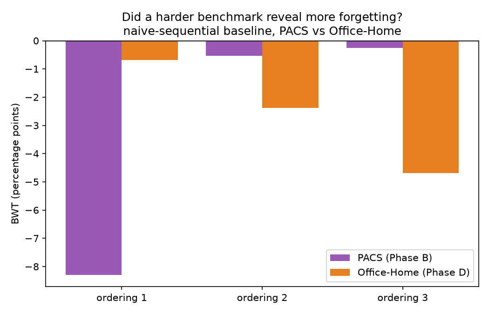
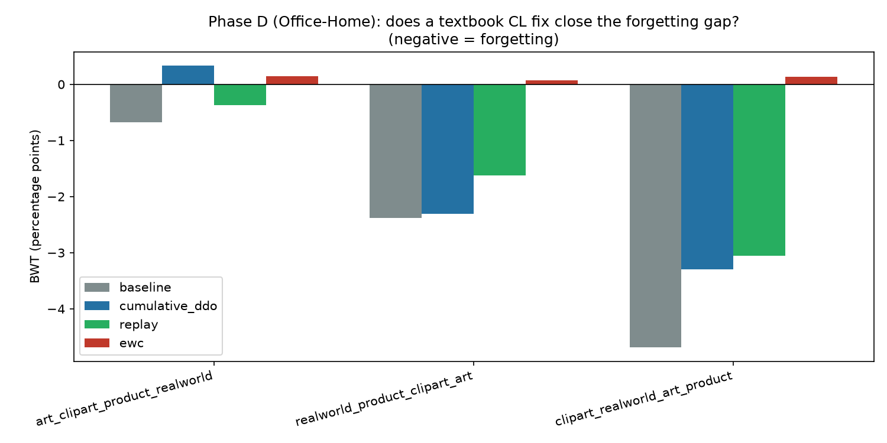
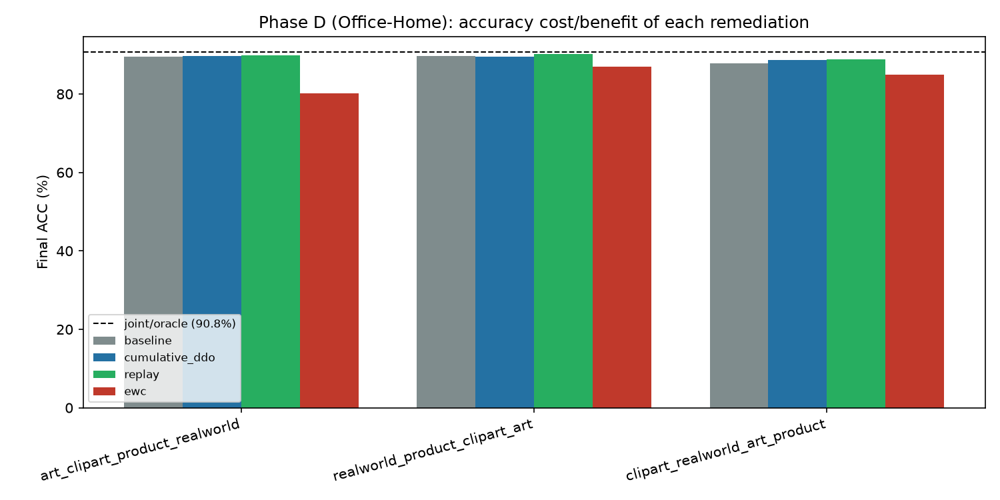

# Phase D — Domain-IL sequential protocol on Office-Home (stretch goal, promoted)

**Status: yes, a harder benchmark reveals more forgetting. All three domain orderings show real, consistent negative BWT on Office-Home (−0.7 to −4.7), unlike PACS where only 1 of 3 did. The "near-free" remediations (cumulative DDO, replay) only partially close the gap here, not fully as they did on PACS — the strongest evidence yet for Pillar 1's core claim.**

## What we predicted

Phase B found real forgetting on PACS in only 1 of 3 domain orderings, and Phase C's cheap remediations (cumulative DDO, replay) nearly fully closed even that one gap. The working theory (`results/phase_b_domain_il.md`, `results/phase_c_remediation.md`) was that PACS's near-ceiling accuracy (98.3% joint ACC on 7 easy, visually-distinct classes) left too little headroom for forgetting to show up clearly — not that the architecture is actually robust. Office-Home (65 classes, far less data per class per domain) was proposed as the test of that theory: if PACS was just too easy, a harder benchmark should reveal a stronger, more consistent forgetting signal and make the remediations look less trivially sufficient.

## What we did

Identical protocol, hyperparameters, and code to Phase B/C — same `DomainILSession` harness (generalized to accept any dataset's domains/loader instead of PACS being hardcoded), same joint/oracle vs. naive-sequential design, same ACC/BWT/DDO-erosion metrics, same 50 epochs/stage, batch 64, lr 1e-4, alpha=1, same three remediations (cumulative DDO, cached-embedding replay, EWC λ=1000). Only the dataset changed: Office-Home — 4 domains (Art, Clipart, Product, Real World), 65 classes (everyday office/home objects), ~15,588 images (official release, exact match to published stats), 80/20 stratified split. New 257-concept bank (65 classes × ~4 concepts, three phrases intentionally shared across visually similar object pairs — e.g. "a flat base" for bottle/mug). Three domain orderings: Art→Clipart→Product→Real World, Real World→Product→Clipart→Art (reverse), Clipart→Real World→Art→Product (mixed).

## Result

**Joint/oracle: ACC = 90.78%** (art 90.7%, clipart 82.1%, product 96.9%, real_world 93.5%) — meaningfully below PACS's 98.3% ceiling, exactly as the harder-benchmark theory predicted, though still fairly high (65-way classification over CLIP concept-activation features is not as hard for this architecture as one might expect from the class count alone).

| Domain order | Baseline BWT | Cumulative DDO | Replay | EWC |
|---|---|---|---|---|
| art → clipart → product → real_world | −0.68 | +0.33 | −0.37 | +0.15 |
| real_world → product → clipart → art | −2.39 | −2.31 | −1.63 | +0.08 |
| clipart → real_world → art → product | −4.68 | −3.30 | −3.06 | +0.14 |

**The headline finding**: unlike PACS, where 2 of 3 orderings had essentially zero BWT and only one showed real forgetting, **every single Office-Home ordering shows negative baseline BWT** — real, consistently-present forgetting, not a one-off. It's also not just "the same effect, bigger everywhere": ordering 1 (art-first) is actually less severe on Office-Home than PACS's worst case, but orderings 2 and 3 are clearly worse on Office-Home than their PACS counterparts. The more scientifically important property isn't "always bigger" — it's "always negative," which removes the "maybe that one PACS ordering was a fluke" caveat Phase B had to carry.

**The remediations are now only partial fixes, not clean wins.** Cumulative DDO and replay reduce BWT in every ordering, but leave real forgetting behind in the harder two orderings (cumulative DDO: −2.31, −3.30; replay: −1.63, −3.06) — a real improvement, not a solved problem, unlike Phase C's PACS result where they nearly zeroed it out. EWC again drives BWT close to zero in every ordering (never worse than +0.15) — but at a real, larger accuracy cost than on PACS (80.2–86.9% vs. baseline's 87.8–89.6%, still the classic stability-plasticity tradeoff at this untuned λ).

## Interpretation

This is the strongest evidence in the whole project so far for Pillar 1's core claim. It confirms the theory from Phase B/C directly: PACS's forgetting wasn't absent because LanCE has some hidden resilience — it was masked by a task too easy to expose the failure mode cleanly. Office-Home, with far less data per class per domain and a much larger class taxonomy, reveals the same underlying mechanism (naive sequential fine-tuning of `W_F` with no replay) producing consistent, real degradation across every domain ordering tested, and shows that the cheap fixes that looked like a near-complete solution on PACS are only partial here.

That said, this still isn't a dramatic, catastrophic collapse in the sense the CL literature sometimes shows (near-chance accuracy after forgetting) — the worst baseline case (−4.68 BWT) still leaves the model at 87.8% ACC, well above chance and only ~3 points below the joint/oracle ceiling. The honest characterization is: real, consistent, moderate forgetting that a harder benchmark reliably surfaces and that off-the-shelf fixes only partially patch — a materially stronger empirical case than PACS gave, without overclaiming a dramatic failure that the numbers don't show.

## Honest limitations of this experiment

- Same caveats as Phase B/C: only 3 of 24 possible orderings tested, single run per condition/ordering (no seed sweep), EWC's λ=1000 not tuned for this problem.
- The 257-concept Office-Home bank is a first-pass hand-written draft (4/class), the same honesty caveat Phase B's PACS bank carried — a richer, more carefully curated concept bank could plausibly change the numbers, especially given Office-Home's more visually complex, often cluttered real-world images compared to PACS's cleaner four styles.
- Office-Home's Clipart domain has the lowest joint/oracle accuracy (82.1%) of any domain tested across both PACS and Office-Home — worth flagging as a domain that may be intrinsically harder for this concept-bottleneck architecture, independent of the continual-learning question, and something Pillar 2's questions about backbone coverage could plausibly speak to as well.
