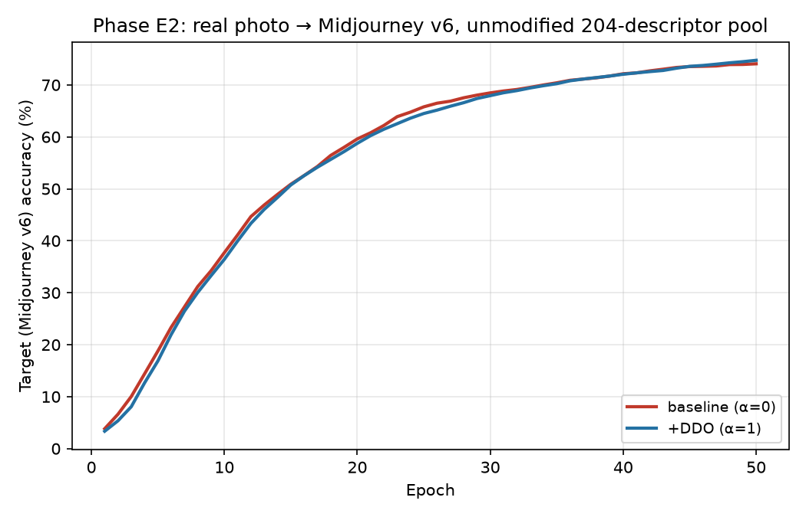
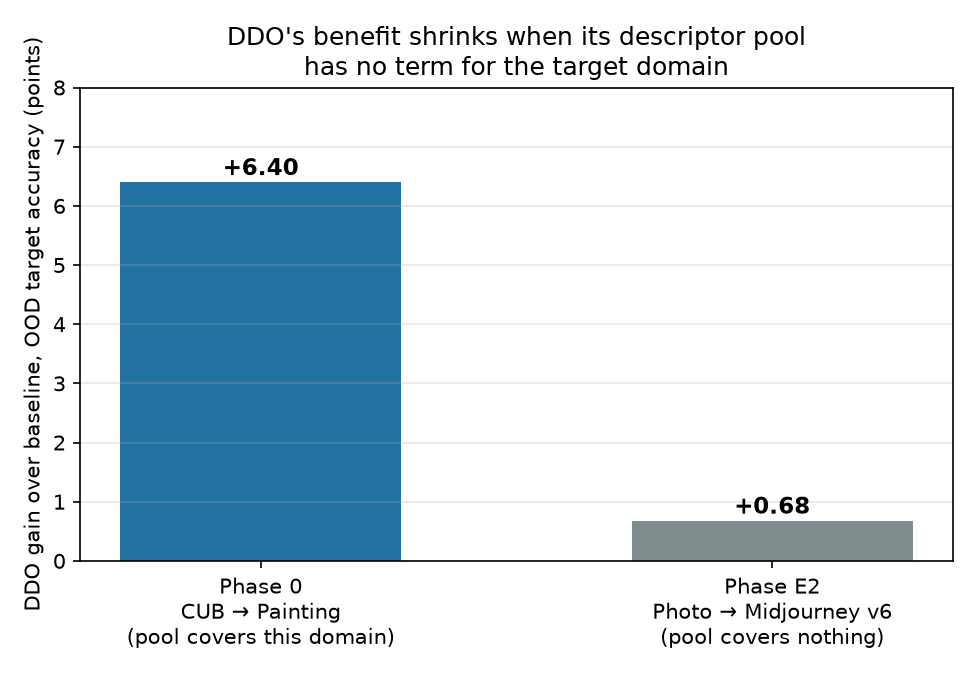
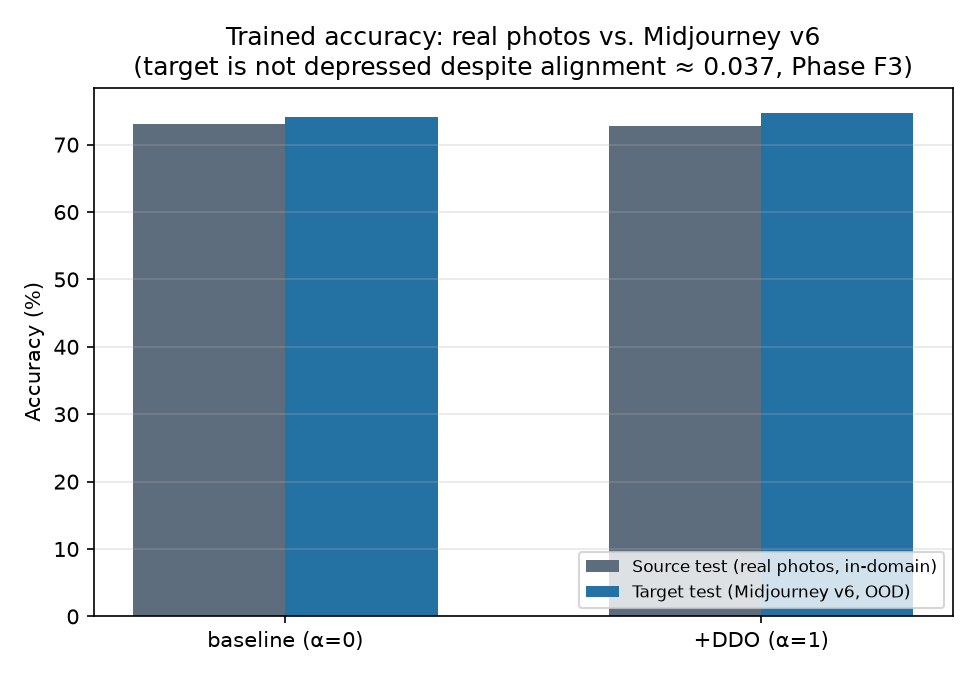

# Phase E2 — real baseline-vs-+DDO training run: photo → Midjourney v6 (Pillar 2)

**Status: confirmed, and more nuanced than a simple pass/fail.** DDO's benefit over baseline collapses from Phase 0's +6.40 points (CUB → CUB-Painting, a domain the descriptor pool covers well) to **+0.68 points** here (real photos → Midjourney v6, a domain the pool covers with zero relevant terms — confirmed directly in Phase E1). But this is *not* a story of the model failing outright on the new domain: target accuracy (74.1–74.7%) is not depressed relative to source, in-domain accuracy (72.8–73.0%) — despite Phase F3 measuring a near-zero alignment score (0.037) for this exact domain shift.

## Why this had to be run

Phase F3 measured an *alignment score* — a representation-level proxy — and found it near zero for real-photo-vs-Midjourney shifts. Its own write-up flagged a limitation explicitly: "no training run was involved — this is a representation-level analysis, not a test of how a trained LanCE model would actually perform on this domain." Separately, Phase E1 found LanCE's actual frozen descriptor pool contains zero terms for any AI-generated-image domain. Neither result, on its own, says what happens to *trained-model accuracy*. This phase runs the real experiment: an actual CLIP-CBM baseline (α=0) vs. +DDO (α=1) training run, source domain = real photos, target domain = Midjourney v6 images never seen during training — closing the gap both F3 and E1 left open.

## What we did

**Data**: Defactify/MS-COCO-AI (same dataset as Phase F3, already downloaded locally). Captions were keyword-tagged against the 80 standard COCO categories (identical heuristic to Phase F3). Kept every category with at least 90 tagged samples on **both** the real-photo side (Label_B=0) and the Midjourney v6 side (Label_B=5), across all three dataset splits combined (train/validation/test, 96,000 rows total) — **23 categories** qualified: bus, train, toilet, giraffe, car, motorcycle, bench, bird, sink, airplane, person, cat, sheep, fire hydrant, dog, stop sign, traffic light, bicycle, bowl, truck, clock, oven, chair. Capped at 200 images/class/domain for balance (most classes hit the cap; a few smaller ones — chair, oven — used all 91–98 available). Wrote a 76-concept hand-written concept bank (4 concepts/class, e.g. "a very long slender neck" / "a spotted brown and tan coat pattern" for giraffe) — same first-pass-draft methodology as every other dataset in this project.

**Split**: real photos, 80/20 stratified per class → 3,303 training images / 826 source (in-domain) test images. Midjourney v6 images: 4,129 images, used entirely as target (OOD) test — zero exposure during training, mirroring Phase 0's CUB→CUB-Painting design exactly.

**Model & descriptor pool — the critical detail**: `clip_cbm_orth` (identical architecture to every other phase), CLIP ViT-L/14. Domain differences for DDO's regularizer were computed against the **actual, unmodified 204-entry `target_text_prompts` pool** from `prompts/prompt200new.py` — the same file every phase in this project trains against, with no Midjourney-specific descriptor added. This is the whole point of the test: it reproduces exactly what happens when a model trained today, using LanCE's existing pool, meets a domain nobody curated the pool for.

**Protocol**: 50 epochs, batch size 64, AdamW, lr 1e-4, weight_decay 1e-4 — identical to Phase 0/A's protocol, so the DDO gain here is directly comparable to Phase 0's own measured +6.40-point gain.

## Result

| | Baseline (α=0) | +DDO (α=1) |
|---|---|---|
| Source (real photo) test accuracy | 73.00% | 72.76% |
| **Target (Midjourney v6) test accuracy** | **74.06%** | **74.74%** |
| DDO gain over baseline (target) | — | **+0.68 points** |
| *Phase 0 reference (CUB → Painting)* | *50.64%* | *57.04%* |
| *Phase 0 DDO gain* | — | ***+6.40 points*** |

Both baseline and +DDO climb from near-chance (23 classes, ≈4.3% chance) to the low-mid 70s over 50 epochs, tracking each other closely throughout training (see the first figure) — the curves are nearly on top of each other, unlike Phase 0's baseline/+DDO curves, which separate clearly and stay separated. The final gap (+0.68 points) is roughly a **tenth** the size of Phase 0's own +6.40-point gain, measured under an identical protocol.

**A second, independent finding, not part of the original prediction**: target (Midjourney) accuracy is not lower than source (real photo) accuracy — if anything it's slightly higher in both conditions (74.06% vs. 73.00% baseline; 74.74% vs. 72.76% +DDO). This is despite Phase F3 measuring a near-zero alignment score (0.037) for this exact real-photo-to-Midjourney shift. A plausible explanation: Midjourney's outputs for common object categories tend to be clean, centered, prototypical renderings — possibly *easier* to classify than the visual clutter and occlusion typical of real COCO photos, independent of anything about domain alignment. Both curves were also still climbing at epoch 50 (not fully plateaued) — kept at 50 epochs to match Phase 0's protocol exactly rather than extending training, which would break the direct comparison.

## Honest interpretation

This does not mean the model "fails badly" on a genuinely new domain in the sense of collapsing to poor accuracy — it doesn't. It means something narrower and more precise, and it directly answers the question this phase was built to answer: **DDO's specific value-add — the extra accuracy it's supposed to buy over a plain classifier by anticipating the target domain through text — evaporates almost entirely when its fixed descriptor pool has no term for that domain.** Phase 0 showed DDO is worth +6.40 points when the pool covers the shift well (many painting-related descriptors exist). Phase E2 shows that same mechanism, run under identical conditions, is worth only +0.68 points when the pool has zero coverage (Phase E1) — a reduction to roughly a tenth of its value, not a reversal to actively harmful, but a near-total loss of the method's specific benefit over a plain concept-bottleneck baseline.

This connects Phase E1 and Phase F3 into one coherent story: the frozen descriptor list has no words for this domain (E1) → the words CLIP *would* need don't align well with real images of it either (F3, alignment 0.037) → and the practical consequence for DDO's own contribution, measured directly rather than inferred, is that it stops adding meaningful value (E2, +0.68 vs. +6.40 points). At the same time, this reinforces rather than contradicts Phase F2's earlier finding: a *trained* classifier (baseline or +DDO, either one) still reaches strong absolute accuracy (72–75%) on this domain — training recovers the signal, as F2 found for EuroSAT. What's specifically and narrowly broken is DDO's zero-target-data, text-only mechanism for adding value *beyond* that trained baseline — not the model's ability to classify the new domain at all.

## What this changes for the overall argument

This is the most direct, least-inferred evidence in Pillar 2 for the closed-world critique (Failure Mode 1/3 combined): not an alignment-score proxy, not a descriptor-list inspection alone, but an actual trained-model accuracy comparison, run under the exact protocol used to establish DDO's benefit in the first place. It shows the closed-world assumption has a real, measured cost — just a different, more specific cost than "the model breaks" — it's "the method's specific advantage over a simpler baseline disappears."

## Honest limitations of this experiment

- **Single run per condition, no seed sweep** — same caveat as every other phase. A +0.68-point gain is small enough that run-to-run noise could plausibly explain some of it; it should be read as "DDO's benefit shrinks dramatically," not as a precisely pinned-down number.
- **Both curves were still rising at epoch 50**, not fully converged — kept fixed to match Phase 0's protocol exactly rather than training longer, which would have broken the direct comparison but leaves open whether the gap changes with more epochs.
- **One target generator tested (Midjourney v6)** — chosen for consistency with Phase F4 and this conversation's own example; the other 4 generators Phase F3 tested were not run through a full training comparison here.
- **The 76-concept Defactify bank is a first-pass hand-written draft** (4 concepts/class), same honesty caveat every other dataset's bank in this project carries.
- **The "target accuracy ≥ source accuracy" finding is a new observation, not something this phase was designed to test rigorously** — the "Midjourney images may be more prototypical" explanation is plausible but not verified against, e.g., a human-rated image-quality/typicality score.
- Category labels come from the same caption keyword-matching heuristic Phase F3 used (not ground-truth annotations) — a small amount of label noise is possible.
