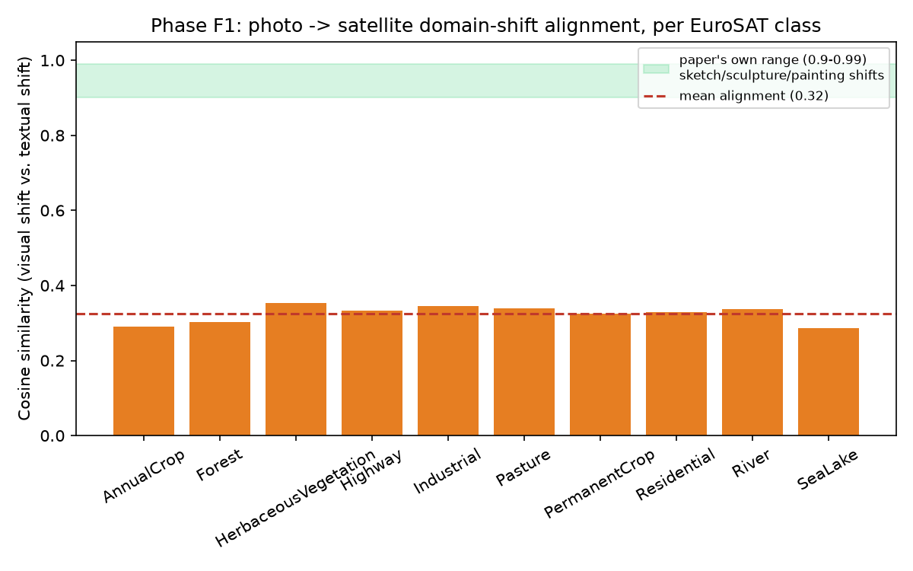

# Phase F1 — domain-shift alignment check on EuroSAT (Pillar 2)

**Status: PASS — a clear, large-margin falsification of Sec. 3's premise for a domain outside CLIP's comfort zone.**

## What we predicted

LanCE's entire mechanism (Sec. 3) rests on the claim that CLIP's shared embedding space aligns *visual* domain shifts with *textual* domain descriptions — demonstrated in their own Fig. 2/8 only for domains heavily represented in CLIP's training data (sketch, painting, sculpture, clipart), with a reported alignment score of 0.90–0.99. We predicted that a photo→satellite domain shift — a modality scarce in CLIP's web-scraped pretraining data — would score well below that range, directly falsifying Sec. 3's premise outside CLIP's comfort zone.

## What we did

EuroSAT (10 land-cover classes: annual crop, forest, herbaceous vegetation, highway, industrial, pasture, permanent crop, residential, river, sea/lake — 27,000 satellite images total, official release via `torchvision.datasets.EuroSAT`, no manual download needed). For each class, computed the same shape of alignment test as the paper's own Fig. 2: cosine similarity between a *visual* domain-shift direction and a *textual* domain-shift direction.

**Adaptation, stated honestly** (matching this project's practice of documenting deviations from the plan's literal description — see Phase C's cumulative-DDO note): the paper's Fig. 2 visual shift is real-photo-image embedding vs. real-target-domain-image embedding. We don't have a matched "ground photo of a forest/highway/…" image dataset, and sourcing one would turn a "cheap, minimal setup" phase into a second dataset-acquisition project. Instead we used CLIP's own text embedding of `"a photo of a {class}."` as the photo-domain reference point in CLIP's shared embedding space — justified by CLIP's own well-documented near-unity image-text alignment for exactly this kind of everyday-photo domain (their own Fig. 2 baseline), and consistent with how this codebase's `domain_diffs` machinery already represents domains via text prompts everywhere else (`source_text_prompts = ['a photo of a {}.']`, never a real photo image). So: `visual_shift = mean_image_embedding(EuroSAT satellite images) − text_embedding("a photo of a {class}.")`; `textual_shift = text_embedding("a satellite image of a {class}.") − text_embedding("a photo of a {class}.")`; `alignment = cosine_similarity(visual_shift, textual_shift)`. 200 images/class sampled (2,000 total), ViT-L/14 (consistent with every other phase in this project), no training run.

## Result

**Mean alignment: 0.324** — every one of the 10 classes lands between 0.28 and 0.35, dramatically below the paper's own reported 0.90–0.99 range, with no overlap at all.

As a second, independent signal: our own zero-shot classification accuracy on EuroSAT (using `"a satellite image of a {}."` prompts, same ViT-L/14) was **64.05%** — close to OpenAI's own published 59.6% (ViT-L/14-336px; the small gap is plausibly explained by model-variant differences and our use of a single prompt vs. their prompt ensemble, not a meaningful discrepancy) — and both numbers sit far below the 98.1% linear-probe ceiling on the identical visual features that OpenAI reports (cited directly, not reproduced here — see Phase F2 for our own version of that comparison).

## Interpretation

This is a strong, unambiguous result in the predicted direction: CLIP's image-text alignment — the one mechanism LanCE's concept activations and DDO loss depend on entirely — breaks down badly for satellite imagery, a domain outside its training distribution's comfort zone. A 0.32 mean alignment against a claimed 0.90–0.99 range isn't a marginal miss; it's roughly a third of the paper's own lower bound. This directly supports Failure Mode 3 (`docs/lance_continual_dg_failure_analysis.md`) and the authors' own admitted limitation (Appendix G: *"these models are limited in application to some professional fields like medical treatments"*) with a fresh, independently-measured number rather than just the authors' own citation.

**What this does and doesn't establish, pending Phase F2**: this shows the *text-to-image alignment* is weak. It does not by itself show whether the underlying *visual representation* is also degraded, or whether it's specifically the language-alignment step that fails while the vision is fine (OpenAI's own 59.6%/98.1% split suggests the latter for their model variant) — that's exactly what Phase F2 tests next.

## Honest limitations of this experiment

- The "photo" reference uses CLIP text embeddings, not real photo images, as documented above — a principled substitution, but not a literal reproduction of the paper's Fig. 2 methodology. If it matters, a version with a real matched photo dataset (e.g. Places365's forest/highway/residential classes) would be the natural follow-up.
- 200 samples/class is a subsample of EuroSAT's ~2,700/class — sufficient for a stable mean image embedding, but not the full dataset.
- Uses ViT-L/14 throughout (consistent with every other phase), not the ViT-L/14-336px variant OpenAI's 59.6%/98.1% numbers were reported for — flagged wherever those numbers are cited rather than reproduced.
