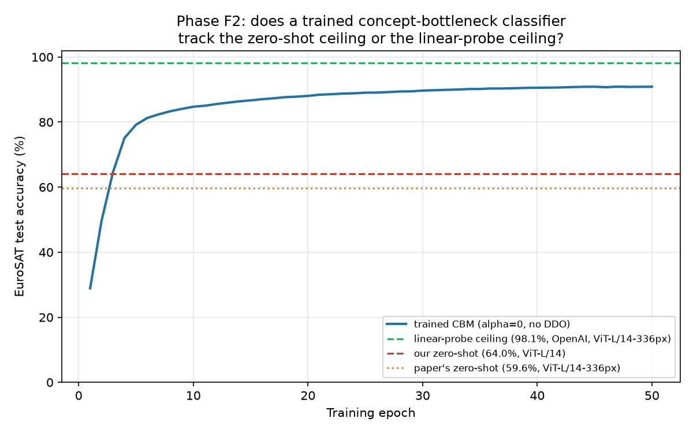

# Phase F2 — concept-activation ceiling test on EuroSAT (Pillar 2)

**Status: the literal hypothesis was wrong, and that's the finding. A trained concept-bottleneck classifier reaches 90.9% — far closer to the linear-probe ceiling (98.1%) than to the zero-shot ceiling (59.6–64%). This doesn't overturn Phase F1 or Pillar 2's underlying critique; it relocates exactly where the critique bites, the same pattern this project has now seen three times (Phase A, Phase B, here).**

## What we predicted

Per the plan: *"If CBM accuracy tracks near 59.6% rather than 98.1%, that shows concept-bottleneck models inherit CLIP's alignment weakness even where the visual information is demonstrably present in the representation — a 'long-run ceiling' that no amount of continual-learning fixes to the classifier can lift."* Given Phase F1's finding (weak image-text alignment for satellite imagery, 0.32 vs. the paper's own 0.90–0.99), the expectation was that a concept-bottleneck classifier — which depends on that same alignment mechanism (concept activations are cosine similarities between images and concept *text* embeddings) — would be capped near the zero-shot ceiling, not the linear-probe one.

## What we did

Trained a plain CLIP-CBM — the same `clip_cbm_orth` architecture used in every other phase of this project, with `alpha=0` so the DDO term contributes nothing ("no DDO," per the plan) — on EuroSAT's own 10 classes, **in-distribution** (80/20 stratified split, 21,600 train / 5,400 test images, all EuroSAT satellite imagery, no domain shift). 40-concept bank (4 texture/pattern descriptors per class, e.g. "a dense canopy of dark green treetops" for forest, "a long straight paved strip" for highway), 50 epochs, batch 64, lr 1e-4 — same hyperparameters as every other phase. Compared final accuracy against Phase F1's two anchors: ~60–64% zero-shot, 98.1% linear-probe (OpenAI's published number, cited not reproduced).

**Important, stated explicitly per the plan's own framing:** this is *not* a domain-generalization test. EuroSAT's classes aren't in PACS/Office-Home/CUB's label space, and train/test here is a random split of the same domain, not a source→target shift. It's a precondition check on whether concept-based classification works at all in a modality CLIP aligns poorly with.

## Result

**Best test accuracy: 90.89%** (final epoch: 90.87%, converged smoothly — 28.9% after 1 epoch, 85% by epoch 11, 90%+ by epoch 36).

This is **not** what the plan predicted. 90.9% sits far above both zero-shot numbers (59.6% published, 64.05% our own measurement) and much closer to the 98.1% linear-probe ceiling — a ~7-point gap to the ceiling, not a ~30-point gap to zero-shot.

## Why this probably isn't what it looks like at first glance

The literal hypothesis — "CBM accuracy tracks near the zero-shot number" — is directly falsified by these numbers. But the reason clarifies rather than undermines Pillar 2's underlying argument, once the mechanism is worked through:

A **linear probe** (98.1%) trains a classifier directly on the raw 768-dim CLIP image embedding — full access to whatever visual information CLIP's image encoder captured, no language involved at all. **Zero-shot** classification (59.6–64%) uses *no* training data at all; it relies entirely on CLIP's own frozen alignment between a class-name text embedding and the image embedding, at inference time, with no chance to correct for a poor match. The **CBM here sits in between, architecturally** — it projects the image embedding into a 40-dimensional concept-activation space (image embedding vs. 40 concept text embeddings) and then **trains** a linear layer on top of that projection, on 21,600 labeled EuroSAT images. Training changes everything: even though each individual concept's image-to-text alignment may be imperfect (consistent with F1's finding), a trained `W_F` can still learn to weight and combine 40 imperfect signals into a decision boundary that recovers most of the class-discriminative information the underlying 768-dim embedding contains — because that information was never actually destroyed by the concept projection, just imperfectly labeled by language. Zero-shot has no such recovery mechanism; it takes CLIP's raw text-image match at face value, with no correction.

**This is the key distinction Pillar 2's argument needs to make precise, and Phase F2 forces it into the open:** the *visual representation* is fine (this echoes, rather than contradicts, F1 and OpenAI's own linear-probe number — both already implied this). What's specifically broken is *zero-shot, training-free* image-text alignment. And LanCE's DDO mechanism (Eq. 12) is architecturally a **zero-target-data, text-only simulation** — it predicts what a new domain's images will look like in concept-activation space using *only* text descriptors, never real images from that domain (by design — that's the entire point of domain generalization: handling a domain with no labeled training data). Phase F2 shows that *if you have real labeled data from the new domain*, a trained classifier does fine even in a modality CLIP aligns poorly with zero-shot. But that's exactly the resource domain generalization assumes you don't have. So the accurate, narrower claim is: **DDO's specific mechanism for handling a new domain (text-only simulation, no target data) inherits CLIP's zero-shot alignment weakness — not because the backbone's vision is bad, but because DDO has no access to the recovery mechanism (real target-domain training) that made Phase F2's 90.9% possible.** The ceiling argument in the original plan was about the wrong thing (a hypothetical trained-CBM ceiling); the real ceiling that matters for LanCE specifically is what DDO's zero-target-data text simulation can achieve, which F1's weak alignment score (0.32) already speaks to directly.

## What this changes for the overall argument

The original Phase F2 framing needs correcting in the write-up: it's false that "CBM accuracy tracks near zero-shot" — it doesn't, and future proposal drafts should not claim that. What survives, and is now stated more precisely, is: **CLIP's frozen backbone has a real, demonstrated coverage gap for out-of-distribution modalities like satellite imagery (Phase F1, 0.32 alignment), and DDO's specific fix mechanism (text-only domain simulation) has no way to route around that gap, because it never touches real target-domain data.** That's a narrower but more defensible version of Pillar 2's original claim — and, combined with Phase F1, still stands as evidence independent of anything Phases B–D found about forgetting.

## Honest limitations of this experiment

- The 40-concept EuroSAT bank is a first-pass hand-written draft (4/class), same caveat as PACS's and Office-Home's banks — a richer bank might close or widen the gap to the linear-probe ceiling somewhat.
- This experiment cannot directly test the counterfactual claim above (that DDO's zero-target-data mechanism specifically would fail on EuroSAT) — that would require actually running LanCE's DDO training pipeline on a real cross-modality domain shift (e.g., photo→satellite as source→target, the way Phase 0 did for CUB→CUB-Painting), which is a larger follow-up, not attempted here.
- Single run, no seed sweep, consistent with every other phase's stated limitation.
