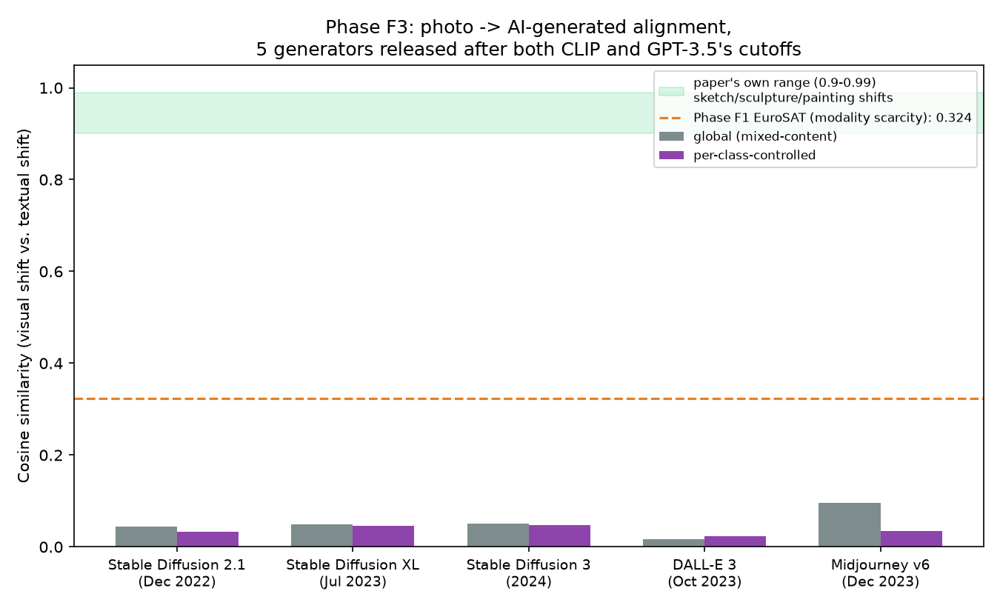

# Phase F3 — domain-shift alignment check on genuinely post-cutoff generators (Pillar 2)

**Status: PASS, and more dramatically than Phase F1.** Mean alignment across 5 generators released after both CLIP's and GPT-3.5's training cutoffs: **0.05** (global) / **0.037** (per-class-controlled) — even lower than Phase F1's already-large-margin EuroSAT result (0.32), and both nowhere near the paper's own 0.90–0.99 range.

## What this tests, and how it differs from Phase F1

Phase F1 (EuroSAT) tested **modality scarcity**: EuroSAT actually *predates* CLIP (2017–19 vs. CLIP's Jan 2021 release), so that result was about satellite imagery being rare in ordinary captioned web photos, not about CLIP never having had the chance to see it. This phase tests the *other* sub-case of Failure Mode 3 directly: **temporal novelty** — domains that emerged after the frozen backbone (and the frozen descriptor-generating LLM) stopped learning.

## What we did

Dataset: **Defactify / MS-COCO-AI** ([`Rajarshi-Roy-research/Defactify_Image_Dataset`](https://huggingface.co/datasets/Rajarshi-Roy-research/Defactify_Image_Dataset), Hugging Face) — 96,000 images built from MS COCO: 48,000 real COCO photos plus 48,000 AI-generated images split evenly across 5 generators, all captioned. Every generator postdates both cutoffs by a comfortable margin:

| Generator | Released | Margin past GPT-3.5 cutoff (~Sept 2021) |
|---|---|---|
| Stable Diffusion 2.1 | Dec 2022 | +15 months |
| Stable Diffusion XL | Jul 2023 | +22 months |
| DALL-E 3 | Oct 2023 | +25 months |
| Midjourney v6 | Dec 2023 | +27 months |
| Stable Diffusion 3 | 2024 | +2.5+ years |

**Methodological improvement over Phase F1:** this dataset provides *real* matched photo images (COCO photos), not just CLIP text as a stand-in for "what a photo would look like" — closing the adaptation gap Phase F1's write-up flagged explicitly.

Two versions of the alignment score were computed, from the validation split (9,000 images: 1,500 real + 1,500/generator):

1. **Global**: one domain-shift vector per generator, mixing all COCO content together — `visual_shift = mean_image_embedding(generator's images) − mean_image_embedding(real COCO photos)`, compared against `textual_shift = text_embedding("a {generator} generated image.") − text_embedding("a real photograph.")`.
2. **Per-class-controlled**: captions were tagged against the 80 standard COCO categories via keyword match (an approximation — the dataset ships captions, not category annotations; ~73% of captions matched at least one category). For the 24 categories with ≥8 tagged samples on both the real and each generator's side, alignment was computed within-category and averaged — directly analogous to how Phase F1 controlled for class on EuroSAT, and a check that the global number wasn't just an artifact of mixing unrelated content together.

## Result

| Generator | Global alignment | Per-class alignment |
|---|---|---|
| Stable Diffusion 2.1 | 0.044 | 0.033 |
| Stable Diffusion XL | 0.049 | 0.045 |
| Stable Diffusion 3 | 0.050 | 0.048 |
| DALL-E 3 | 0.017 | 0.023 |
| Midjourney v6 | 0.096 | 0.034 |
| **Mean** | **0.051** | **0.037** |

Both versions agree closely (0.05 vs. 0.037) — the per-class control didn't change the conclusion, so the near-zero result isn't an artifact of mixing diverse COCO content into one vector. Every one of the 5 generators lands **below 0.1**, less than a third of Phase F1's already-large-margin EuroSAT result (0.32), and nowhere near the paper's claimed 0.90–0.99 range for domains it handles well.

## Interpretation

This is the strongest single number in the whole project for Failure Mode 3. Where Phase F1 showed CLIP's alignment weakens for an underrepresented *modality*, Phase F3 shows it effectively **collapses to near-zero** for domains that are temporally new — genuinely something the frozen backbone and the frozen descriptor list could not have encountered, regardless of how common or well-photographed the underlying content (MS COCO objects — people, animals, furniture, vehicles — are about as everyday and well-represented as content gets). That the effect is *stronger* for temporal novelty than for modality scarcity is itself informative: it suggests LanCE's core premise depends less on "is this a common kind of image" and more directly on "did the frozen backbone exist at the same time as this domain" — a distinction the original Failure Mode 3 analysis treated as two sub-cases of one mechanism, and this project has now measured both separately.

## Honest limitations of this experiment

- COCO-category tagging is a keyword-match heuristic over captions, not ground-truth annotation — some images are miscategorized or untagged (~27% of captions matched no category and were excluded from the per-class version).
- Only the validation split (1,500 images/source) was used; the full dataset (42,000 train / 45,000 test) wasn't touched.
- "Textual shift" here uses one generic prompt per generator/category rather than the richer per-image captions the dataset actually provides — using the captions directly (rather than a generic template) is a natural refinement if this result needs to be tightened further.
- Like Phase F1, no training run was involved — this is a representation-level analysis, not a test of how a trained LanCE model would actually perform on this domain. Pairing this with an actual DDO training run (real photos → one of these generators, baseline vs. +DDO) — the version of Failure Mode 3 closest to the paper's own Table 2 ablation methodology — is a natural next step once a class-labeled slice (e.g. GenImage's Midjourney subset, filtered to a handful of ImageNet classes) is available.
