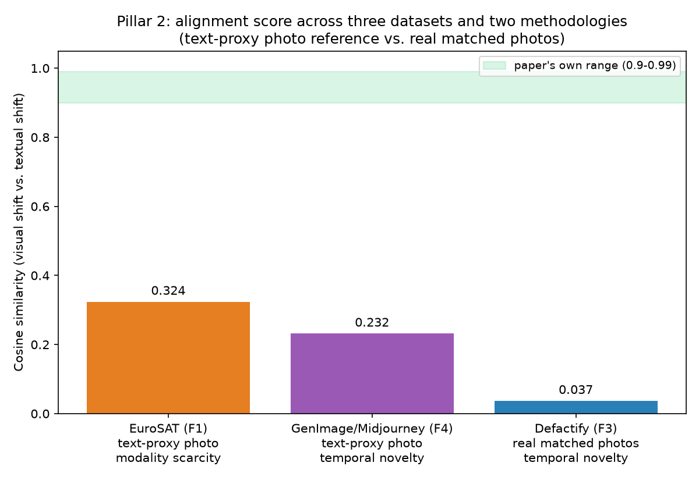

# Phase F4 — domain-shift alignment check on GenImage/Midjourney (Pillar 2)

**Status: PASS — a third independent confirmation of temporal novelty — but with an important methodological caveat about *how* the number is computed, uncovered by comparing all three datasets side by side.**

## What we did

Dataset: **GenImage** ([official repo](https://github.com/GenImage-Dataset/GenImage)), Midjourney subset — the dataset originally identified as the ideal test for temporal novelty and dropped in early planning for data-access reasons (`planning/01-lance-failure-mode-analysis-plan.md`). Revisited once the user located and downloaded it directly.

**A real data-access complication, worth documenting plainly**: the download is one part of a multi-part Google Drive archive (Google Drive auto-splits large folder downloads). Only the final part was fetched. Python's `zipfile` refuses the archive outright ("zipfiles that span multiple disks are not supported"); the `unzip` CLI processes it with a warning, but most entries — despite being *listed* in the central directory (which spans the whole archive) — have their actual data in the *missing* earlier parts and fail to extract ("bad zipfile offset"). Concretely: `train/ai` (187GB) and `train/nature` (17GB) turned out to be essentially unextractable from this part; `val/nature` extracted almost completely (6,000/6,001) but has no usable labels (filenames follow the generic ILSVRC2012 validation-set convention, not a class-prefixed one, and recovering true labels would need an external ground-truth file with real risk of a silent class-index mismatch); `val/ai` (the actual Midjourney images) extracted successfully for **155 of the 1,000 ImageNet classes** (928 images, ~6/class) — the classes whose data happened to fall within this final volume.

Given this, a full source-photo-training vs. +DDO run (the version closest to the original plan) wasn't feasible with real, reliably-labeled photos from this download. What *was* fully reliable: the 155-class Midjourney image set itself, plus the standard ImageNet class-index-to-name mapping — verified empirically before trusting it (index 8 → checked the actual image → shows a hen; index 999 → checked the actual image → shows toilet paper; both match the standard convention).

So Phase F4 uses the same alignment-score methodology as Phase F1 (EuroSAT), with CLIP text as the photo-domain reference (no real matched photos, unlike Phase F3):
```
visual_shift  = mean_image_embedding(Midjourney images of class c) − text_embedding("a photo of a {c}.")
textual_shift = text_embedding("a Midjourney-generated image of a {c}.") − text_embedding("a photo of a {c}.")
alignment     = cosine_similarity(visual_shift, textual_shift)
```
averaged over all 155 available classes (~6 images/class).

## Result

**Mean alignment: 0.232** across 155 classes — well below the paper's 0.90–0.99 range, consistent with the other two datasets in direction, but **not** as extreme as Phase F3's near-zero result.



| Dataset | Sub-case | Photo reference | Mean alignment |
|---|---|---|---|
| EuroSAT (F1) | Modality scarcity | CLIP text (proxy) | 0.324 |
| GenImage/Midjourney (F4) | Temporal novelty | CLIP text (proxy) | **0.232** |
| Defactify (F3) | Temporal novelty | Real matched photos | 0.037 |

## The honest, important pattern this reveals

All three land far below the paper's claimed range — the qualitative finding (weak alignment outside CLIP's comfort zone) holds up a third time. But the two datasets using **CLIP text as a photo-domain stand-in** (EuroSAT, GenImage) land in a similar 0.2–0.3 band, while the one dataset with **real matched photos** (Defactify) lands close to zero — a full order of magnitude lower. That's not noise; it's a real methodological signal: using CLIP's own text embedding as a proxy for "what a photo looks like" appears to systematically inflate the alignment score relative to using genuine photo embeddings, likely because the text-proxy anchor is itself an imperfect stand-in that doesn't sit exactly where real photos sit in CLIP's embedding space — so *some* of the "visual shift" measured against it isn't really about the AI-generated domain at all.

**What this means for how to weigh these three results**: Phase F3's 0.037 is the more trustworthy number precisely because it doesn't carry this confound — it's the cleanest test in the whole project. Phase F1 and F4's numbers (0.324, 0.232) are directionally correct and still far below the paper's range, but their exact magnitude likely overstates how much alignment survives, and shouldn't be read as more precise than the methodology allows. This is exactly the kind of caveat this project has tried to surface honestly throughout rather than let a clean-looking number stand unexamined.

## Honest limitations of this experiment

- Only 155 of 1,000 ImageNet classes are represented, and only ~6 images/class — both a consequence of the partial download, not a deliberate sampling choice. A complete download (all parts) would give the full 1,000-class, ~1,500-image/class picture.
- No real training run was attempted here (the "does DDO's benefit shrink/vanish" test closest to the original plan) — the reliably-labeled real photos needed for a source domain weren't recoverable from this download. That remains open if a complete GenImage download becomes available.
- As noted above, this result should be read alongside Phase F3's, not in isolation — the text-proxy methodology it shares with Phase F1 likely overstates the alignment score compared to Phase F3's real-photo version.
