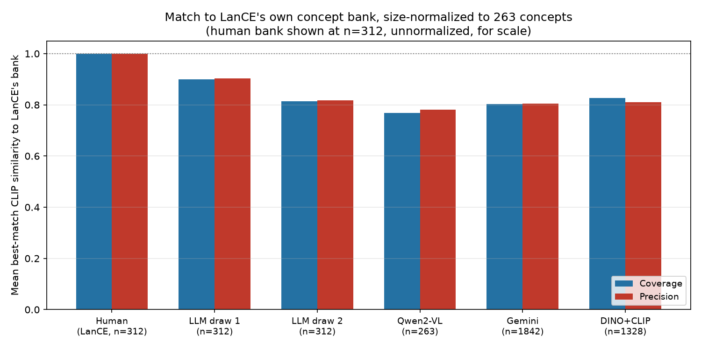
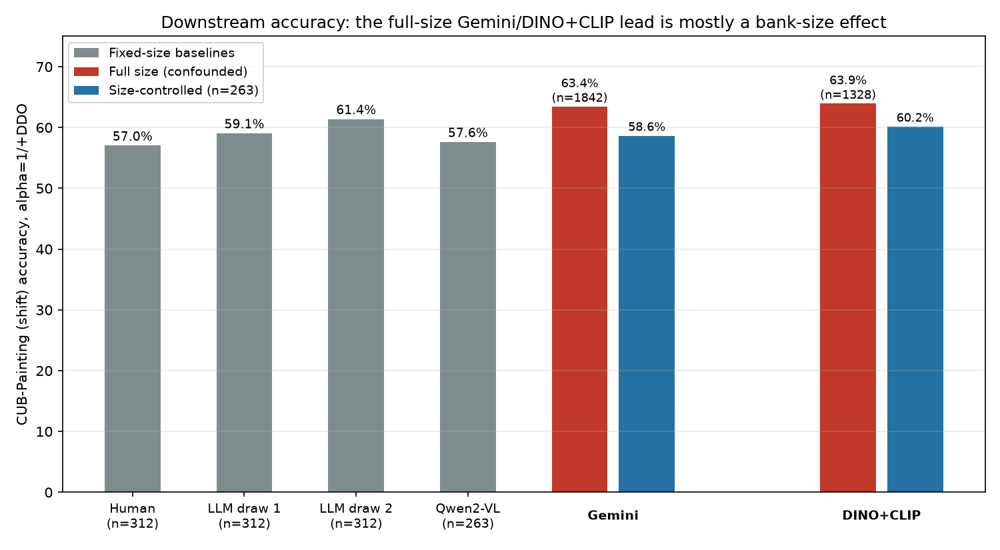

# How well can a VLM generate concepts? VLM prompting vs. detector+CLIP retrieval vs. LanCE's own bank

**Status: ⚠️ Done — partial / mixed result.** A real, honest finding, but one that inverts depending on which axis you look at, and only survives partly once a confound is controlled for.

## 1. One-line summary

Neither image-grounded VLM tested (Gemini, Qwen2-VL) beats simple text-only LLM generation, on either concept-quality-vs-ground-truth or downstream classification accuracy, once concept-bank size is controlled for — the one pipeline that shows a genuine (if modest) edge over the weaker baselines isn't a VLM at all, it's non-generative Grounding-DINO-detected-region + CLIP retrieval.

## 2. Origin

[`planning/09-vlm-image-grounded-concept-generation-plan.md`](../planning/09-vlm-image-grounded-concept-generation-plan.md), all sections (§§1–7).

## 3. The issue this targets

Doesn't map to an existing failure hypothesis. It's a new problem statement suggested by the project's advisor: treat concept-bank *quality* as the research question, rather than a fixed input to the rest of the pipeline — specifically, how good are different VLMs at generating a CUB concept bank when actually shown real images (as opposed to Plan 08's earlier LLM-generated bank, which only ever saw class names, never an image)? The advisor also specifically suggested a DINOv2→CLIP concept-discovery pipeline as a comparison point, which this plan generalized to Grounding DINO (the model that actually produces bounding boxes; see §5) + CLIP.

## 4. Why we tried this approach specifically

Plan 08 already showed LLM-generated concept banks can beat CUB's real human-written bank on both accuracy and (untested at the time) semantic quality — but that generation was **text-only**: one LLM, prompted with nothing but the 200 class names, using general world knowledge, never looking at a single image. The natural next question is whether the *V* in VLM adds anything: does showing a model real training images produce better concepts than reciting what it already knows about "Black-footed Albatross" from its name alone? And separately: is language generation even necessary, or can a non-generative pipeline (detect a part region, retrieve the nearest concept phrase from an existing vocabulary) do just as well without ever writing a sentence?

## 5. Method

### 5a. Shared image sample
5 real CUB training images per class (all 200 classes, seed 42, [`vlm_concepts_sample_images.py`](../external/LanCE/data/CUB/vlm_concepts_sample_images.py)) — the same images shown to every VLM, so any difference between them is attributable to the model, not to which images happened to be sampled.

### 5b. VLM-prompted concept generation
Each VLM was shown its class's 5 images plus a fixed prompt (`vlm_concepts_common.py`'s `PROMPT_TEMPLATE`): "list the visual features that would help distinguish this species... based ONLY on what you can actually see in these specific images... do not rely on general knowledge about this species if it is not visible in the photos shown," 8–15 short atomic phrases, JSON array of strings.

- **Qwen2-VL-7B-Instruct** (open-weight, run locally on the lab GPU server via `transformers`): [`vlm_concepts_generate_opensource.py`](../external/LanCE/data/CUB/vlm_concepts_generate_opensource.py). Needed `repetition_penalty=1.3`/`no_repeat_ngram_size=3` after an early run degenerated into repeating "a dark brown wing" until it hit the token limit.
- **Gemini** (`gemini-3.1-flash-lite`, via API): [`vlm_concepts_generate_gemini.py`](../external/LanCE/data/CUB/vlm_concepts_generate_gemini.py). `gemini-2.5-pro` is deprecated for new API keys (404); the next default, `gemini-3.1-pro-preview`, had **zero** free-tier quota; `gemini-3.6-flash` had a **20-requests/day** free-tier cap (not a rate limit — discovered only after 17 classes ran, then hung on silent retries against a wall that wouldn't move for the rest of the day); `gemini-3.1-flash-lite` had real headroom and was used for the full run. The Claude leg of this plan (`vlm_concepts_generate_claude.py` exists, untested) was dropped — the user chose not to pay for Claude API credits.
- **Claude**: not run. Script exists and is ready if API credits are ever made available.

Both generation scripts are resumable (skip already-completed classes) and moved into `tmux` sessions on the lab GPU server partway through so long runs survived local machine restarts (see `docs/session_handoff.md` for the SSH/GPU-etiquette convention this project already follows).

**Response parsing** (`vlm_concepts_common.parse_concept_list`) needed several rounds of hardening against real, malformed model output: a JSON-array attempt first, then a Python-literal (`ast.literal_eval`) fallback for mixed-quote output, then a quote-pair-aware text-extraction fallback for genuinely broken JSON (with a subtle bug of its own along the way — a naive negative-lookahead regex to exclude JSON *keys* from the fallback misaligned every subsequent quote pairing once one candidate was rejected, since a failed regex match backtracks by one character instead of skipping the whole rejected span; fixed by pairing quotes strictly first, then filtering by lookahead as a separate step).

### 5c. Grounding-DINO → CLIP concept discovery (non-generative)
[`vlm_concepts_generate_dino_clip.py`](../external/LanCE/data/CUB/vlm_concepts_generate_dino_clip.py): **Grounding DINO** (`IDEA-Research/grounding-dino-tiny`, via `transformers.AutoModelForZeroShotObjectDetection` — not DINOv2, which is a self-supervised feature extractor with no detector head and doesn't produce bounding boxes on its own; Grounding DINO is the open-vocabulary detector that actually does) is prompted per-image with a fixed, generic set of anatomical-part text queries ("bird . bill . wing . eye . tail . leg . head . feather . breast . belly . crown . throat . back . neck"), producing bounding boxes (threshold 0.25/0.2). Each detected region is cropped and encoded by CLIP ViT-L/14; the crop's image embedding is matched (cosine similarity, top-2 per box) against a **candidate vocabulary** — since CLIP has no text decoder, it can only *pick* a concept from an existing list, not write one. That vocabulary ([`vlm_concepts_build_candidate_vocab.py`](../external/LanCE/data/CUB/vlm_concepts_build_candidate_vocab.py)) is the deduplicated pool of everything already generated by the VLM-prompting legs (Qwen2-VL + Gemini + Plan 08's two LLM banks — 2,618 phrases), per the user's own choice among the options considered.

### 5d. Concept-quality evaluation
[`vlm_concepts_eval_quality.py`](../external/LanCE/data/CUB/vlm_concepts_eval_quality.py): CLIP ViT-L/14 text-embedding cosine similarity between each generated bank and CUB's real 312 human attributes (`cub_concepts.txt`, LanCE's own concept bank) — **coverage** (per real attribute, similarity to its single best-matching generated concept, averaged) and **precision** (per generated concept, similarity to its single best-matching real attribute, averaged), reported threshold-free (any hard cutoff on CLIP-text cosine similarity is itself unvalidated) plus at two illustrative thresholds, with sample matched pairs saved for manual sanity-checking.

Raw coverage turned out to be structurally biased toward larger banks — more candidate phrases means a closer best match to any given real attribute just from having more draws, an extreme-value-statistics artifact independent of whether the concepts are any good. Fixed by a **size-normalized** comparison: every bank larger than the smallest (263, Qwen2-VL's) is randomly subsampled down to 263 concepts, 50 trials, mean ± std reported — using each bank's own concepts throughout, so size-but-not-quality gets no reward.

### 5e. Downstream classification accuracy
Reused Plan 08's exact protocol unmodified: `train_cached.py --dataset CUB --alpha {0,1} --epochs 50 --batch_size 64 --class_avg_concept --CBM_type clip_cbm --concept_file <bank>`, only `--concept_file` differing, so numbers sit directly next to Phase 0's human-bank baseline and Plan 08's two LLM draws.

Hit a real bug the first time: the CLIP-embedding feature cache (`cache_utils.get_or_build_feature_cache`) is keyed only by dataset name, not concept file, and caches a dummy all-zero `attr_labels` tensor alongside the (real, expensive) image features. Since that cache was first built under the original 312-concept human bank, every later run reusing the cache — including Plan 08's, which happened to also use 312-concept banks — kept that width baked in regardless of the actual concept file in use. Invisible for Plan 08; a hard `BCEWithLogitsLoss` shape-mismatch crash for every bank here (263, 1,842, 1,328 concepts). Fixed in `train_cached.py` by regenerating `attr_labels` at the current concept bank's actual width every run instead of trusting the cached shape — safe because these labels are always an inert placeholder (`beta` defaults to 0 everywhere in this project; confirmed `class_avg_concept` has zero effect anywhere in `model/*.py`, dead code left over from the original released codebase).

**Size-controlled follow-up**: after the full-size downstream numbers showed Gemini and DINO+CLIP unexpectedly winning, the same size confound flagged in §5d was checked on this axis too — [`vlm_concepts_subsample_bank.py`](../external/LanCE/data/CUB/vlm_concepts_subsample_bank.py) subsamples a bank to a fixed size and seed; Gemini and DINO+CLIP were each subsampled to 263 concepts (3 independent seeds), retrained at both alpha values, and compared against Qwen2-VL's real (already n=263) numbers.

## 6. Dataset used, and why

CUB → CUB-Painting only, same as Plan 08 and for the same reason: it's the one dataset in this project with a genuine human-curated concept bank and per-image real attribute labels to compare against, and an established Phase 0/Plan 08 baseline to sit numbers next to directly.

## 7. Code

- Sampling: [`vlm_concepts_sample_images.py`](../external/LanCE/data/CUB/vlm_concepts_sample_images.py)
- Shared prompt/parsing: [`vlm_concepts_common.py`](../external/LanCE/data/CUB/vlm_concepts_common.py)
- Generation: [`vlm_concepts_generate_opensource.py`](../external/LanCE/data/CUB/vlm_concepts_generate_opensource.py) (Qwen2-VL), [`vlm_concepts_generate_gemini.py`](../external/LanCE/data/CUB/vlm_concepts_generate_gemini.py) (Gemini), [`vlm_concepts_generate_claude.py`](../external/LanCE/data/CUB/vlm_concepts_generate_claude.py) (Claude, unrun), [`vlm_concepts_generate_dino_clip.py`](../external/LanCE/data/CUB/vlm_concepts_generate_dino_clip.py) (Grounding DINO + CLIP)
- Vocabulary/pooling: [`vlm_concepts_build_candidate_vocab.py`](../external/LanCE/data/CUB/vlm_concepts_build_candidate_vocab.py), [`vlm_concepts_pool.py`](../external/LanCE/data/CUB/vlm_concepts_pool.py)
- Quality eval: [`vlm_concepts_eval_quality.py`](../external/LanCE/data/CUB/vlm_concepts_eval_quality.py); results: [`vlm_concepts/quality_eval_results.json`](../external/LanCE/data/CUB/vlm_concepts/quality_eval_results.json)
- Size-controlled subsampling: [`vlm_concepts_subsample_bank.py`](../external/LanCE/data/CUB/vlm_concepts_subsample_bank.py)
- Modified: [`external/LanCE/train_cached.py`](../external/LanCE/train_cached.py) (attr_label cache-width fix)
- Downstream-accuracy results: [`results/plan09_downstream_accuracy_comparison.json`](plan09_downstream_accuracy_comparison.json)
- Concept banks: [`cub_concepts_qwen2vl_grounded.txt`](../external/LanCE/data/CUB/cub_concepts_qwen2vl_grounded.txt), [`cub_concepts_gemini_grounded.txt`](../external/LanCE/data/CUB/cub_concepts_gemini_grounded.txt), [`cub_concepts_dino_clip_grounded.txt`](../external/LanCE/data/CUB/cub_concepts_dino_clip_grounded.txt)
- Figures: [`generate_vlm_concept_generation_figures.py`](generate_vlm_concept_generation_figures.py)
- Training logs: `external/LanCE/logs_plan09_*.log` (12 full-size + 12 size-controlled)

## 8. Results

### Concept count, and how well each bank matches LanCE's own concept bank

| Concept bank | # concepts | Coverage vs. LanCE (raw) | Precision vs. LanCE (raw) | Coverage (size-normalized, n=263) | Precision (size-normalized, n=263) |
|---|---|---|---|---|---|
| **Human (LanCE's own bank)** | 312 | 1.0000 (itself) | 1.0000 (itself) | — | — |
| LLM draw 1 (Plan 08, text-only) | 312 | 0.9113 | 0.9039 | **0.8991 ± 0.0017** | **0.9040 ± 0.0027** |
| LLM draw 2 (Plan 08, text-only) | 312 | 0.8206 | 0.8180 | 0.8143 ± 0.0018 | 0.8181 ± 0.0019 |
| Qwen2-VL (image-grounded, 7B) | 263 | 0.7692 | 0.7814 | 0.7692 (already n=263) | 0.7814 |
| Gemini (image-grounded) | 1,842 | 0.8523 | 0.8058 | 0.8028 ± 0.0045 | 0.8054 ± 0.0037 |
| DINO+CLIP (region-retrieval) | 1,328 | 0.8892 | 0.8093 | 0.8259 ± 0.0053 | 0.8104 ± 0.0040 |

(Coverage/precision are mean best-match CLIP cosine similarity, 0–1, not a percentage — see §5d. Full raw numbers plus sample matched pairs for manual sanity-checking: [`vlm_concepts/quality_eval_results.json`](../external/LanCE/data/CUB/vlm_concepts/quality_eval_results.json).)

**Raw (non-size-normalized) coverage put Gemini (0.8523) and DINO+CLIP (0.8892) ahead of LLM draw 2 (0.8206)** — but that ordering doesn't survive size control. At matched size, both drop below LLM draw 2, and Qwen2-VL is the worst match to LanCE's bank at every size tested.

### Downstream classification accuracy

Best-epoch source (CUB in-domain) / target (CUB-Painting, shift) accuracy, `alpha=1`/+DDO (this project's standard headline condition):

| Concept bank | # concepts | Source acc. | Target acc. (shift) |
|---|---|---|---|
| Human (Phase 0) | 312 | 79.52% | 57.04% |
| LLM draw 1 | 312 | 81.24% | 59.07% |
| LLM draw 2 | 312 | 81.93% | **61.40%** |
| Qwen2-VL | 263 | 80.14% | 57.63% |
| Gemini (full size) | 1,842 | 84.40% | 63.44% |
| DINO+CLIP (full size) | 1,328 | 84.84% | 63.93% |
| **Gemini, size-controlled** | 263 | — | **58.65% ± 0.21** |
| **DINO+CLIP, size-controlled** | 263 | — | **60.16% ± 0.22** |

Full numbers (both alpha values, all seeds): [`results/plan09_downstream_accuracy_comparison.json`](plan09_downstream_accuracy_comparison.json).

Std across the 3 size-controlled seeds is small (≤0.0072 target accuracy) — a stable result, not noise.

## 9. What this means

Two different metrics tell two different stories, and neither survives naively:

- **On concept quality vs. real human attributes**, image-grounded VLMs (Gemini, Qwen2-VL) are the two *weakest* banks once size stops flattering the raw numbers — the opposite of what "showing the model real photos should help" predicts.
- **On downstream accuracy**, Gemini and DINO+CLIP looked like clear winners at full size — but ~83% of Gemini's edge over Qwen2-VL and ~55% of DINO+CLIP's edge turned out to be pure bank-size effect (more concept-activation dimensions feeding the classifier, not better concepts). Once controlled for size, Gemini barely edges past Qwen2-VL (58.65% vs. 57.63%) and sits below both LLM text-only draws; DINO+CLIP keeps a real, low-variance edge over Qwen2-VL and LLM draw 1, but even it falls short of LLM draw 2 (61.40%, still the best bank at any size tested on this metric).

The one finding that holds up on **both** axes, after controlling for size: **DINO+CLIP — a pipeline that involves no language generation at all — is competitive with, and on downstream accuracy modestly better than, one of the two independently-generated LLM text-only banks.** That a pipeline which just crops image regions and does nearest-neighbor lookup in an existing phrase pool can match or beat a purpose-built VLM description is the most genuinely surprising result here.

**What doesn't hold up**: the naive full-size headline ("VLM/retrieval concept banks beat everything") was substantially inflated by bank size on both metrics, for both Gemini and DINO+CLIP. Neither of the two image-grounded VLMs tested here — a 7B open-weight model and Gemini's cheapest available tier (see §5b for why: cost/quota constraints, not a deliberate choice) — actually generates *better* concepts than an LLM that never looked at an image at all.

## 10. Verdict

**Partially answers the advisor's question.** We now have real, size-controlled numbers comparing text-only LLM generation, two image-grounded VLMs, and a non-generative detector+retrieval pipeline, on two independent axes (concept-quality-vs-ground-truth, downstream accuracy) — and a genuine, non-obvious finding: image-grounding didn't help either VLM tested, and the strongest new pipeline isn't a VLM. That's a real, reportable result.

What it does **not** settle: whether *no* VLM can beat text-only generation, or just the two (relatively weak/cheap-tier) ones actually tested here. Gemini's flash-lite tier and a 7B open-weight model are not a fair stand-in for what a flagship-tier VLM (GPT-4o/5, Gemini Pro, Claude, at genuine cost) would do — see §12.

## 11. What's next

**Clears the 90% bar — extend to PACS.** This project already has a directly analogous precedent for exactly this kind of finding not generalizing across datasets: Plan 08 found LLM-generated banks beat the human bank on CUB but *lost* on PACS, reversing direction entirely (`results/llm_concept_bank_comparison.md` §"PACS extension"). Given that proven pattern, it is not just plausible but likely that this plan's CUB-specific ranking (DINO+CLIP > Qwen2-VL, LLM draw 2 still best) would look different on PACS — genuinely new, non-redundant information, not a result already predictable from evidence in hand. PACS's domain-IL harness and concept-bank-swap infrastructure (`--concept_file`) already exist from Plan 08's own PACS extension.

**Does not clear the bar on its own, but is a real open scope limitation worth stating plainly**: neither VLM tested here is flagship-tier (§5b, §10) — Gemini's cheapest tier and a 7B open-weight model, both for cost/quota reasons outside this project's control. Whether a genuinely top-tier VLM (with real image-grounded reasoning capability) would change this result is a real open question, but pursuing it requires the user's own cost decision (API billing or reconsidering the Claude leg), not something this project can resolve unilaterally.
